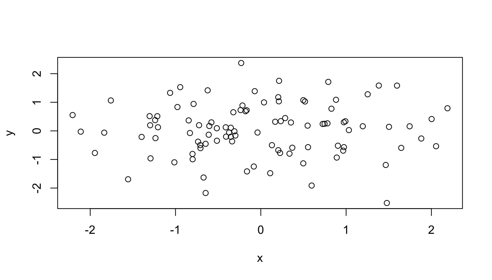
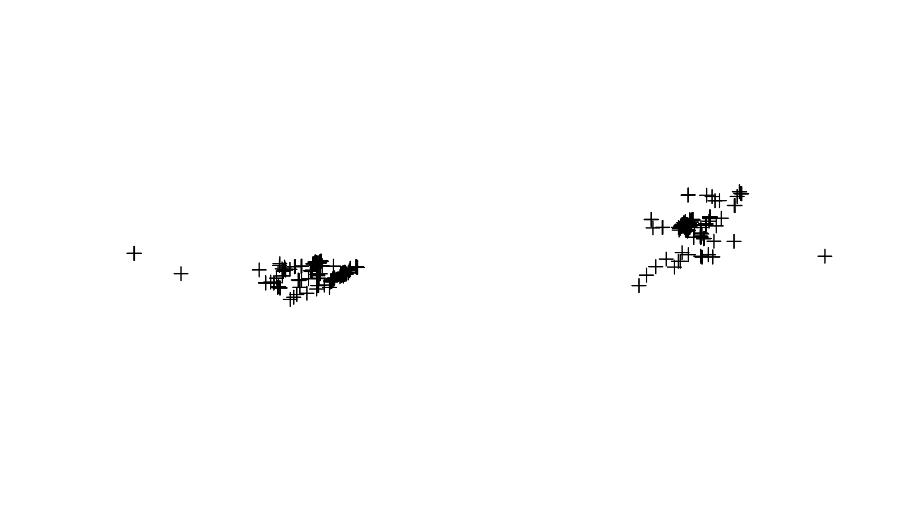
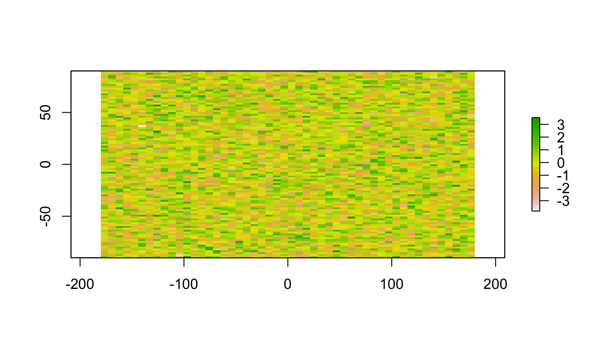
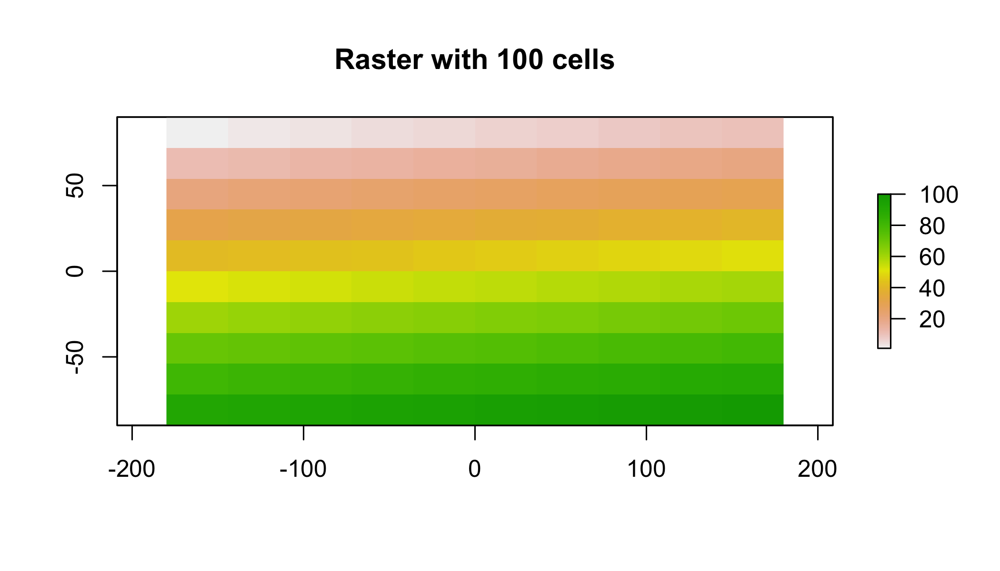
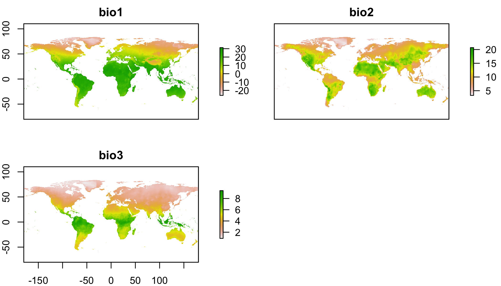
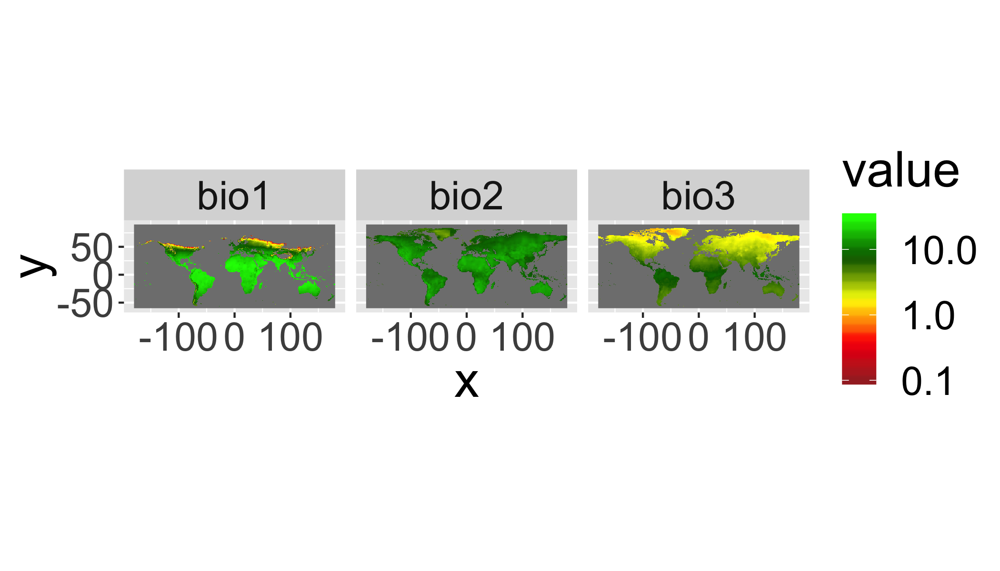
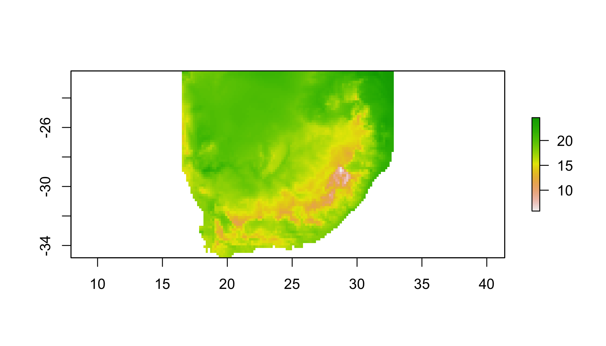
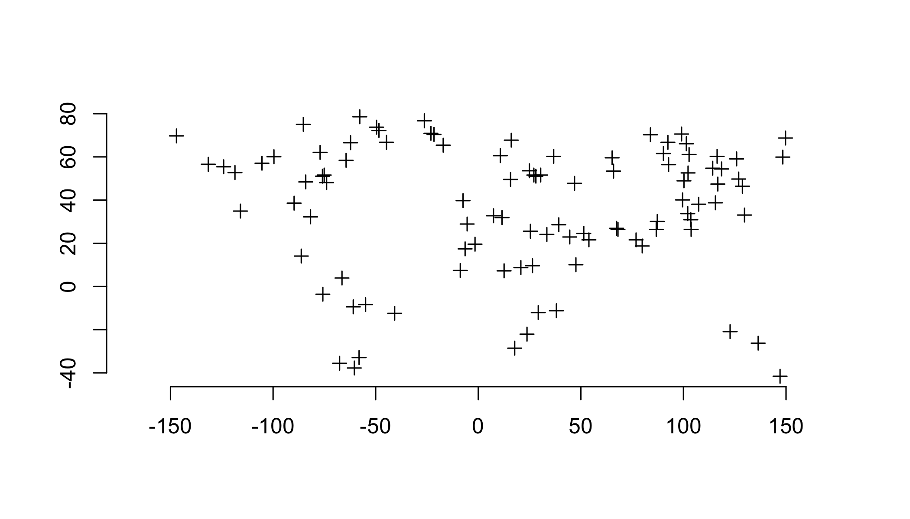
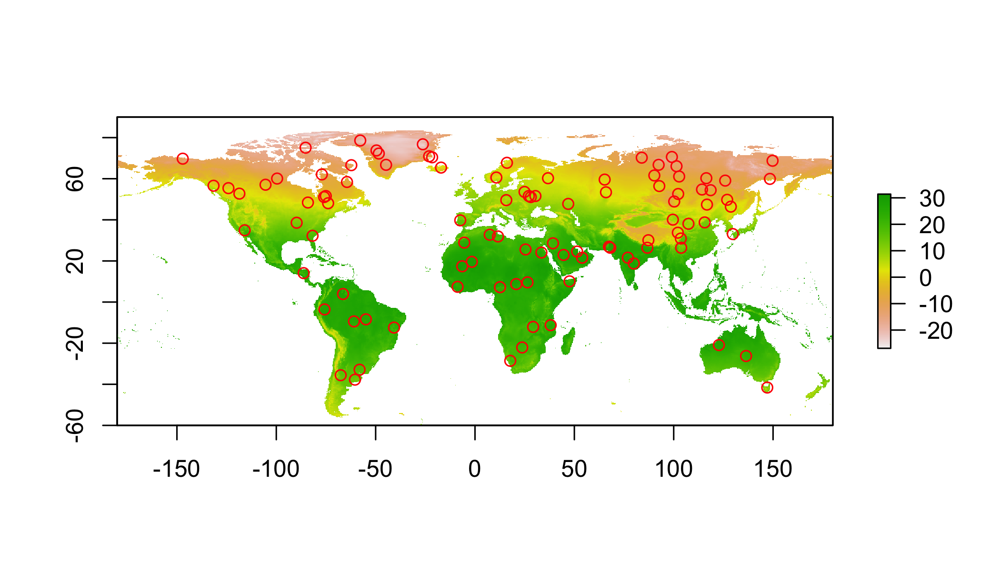

<div>
<iframe src="05_presentation/05_Spatial.html" width="100%" height="700px"> </iframe>
</div>

[<i class="fa fa-file-code-o fa-3x" aria-hidden="true"></i> The R Script associated with this page is available here](05_Raster.R).  Download this file and open it (or copy-paste into a new script) with RStudio so you can follow along.  

This tutorial has been forked from awesome classes developed by Adam Wilson [here]( http://adamwilson.us/RDataScience/)

# Setup

Note that you may need to install some of these packages with, e.g., `install.packages(c('dplyr','tidyr'))`, etc. 


```r
library(dplyr)
library(tidyr)
library(sp)
library(ggplot2)
library(rgeos)
library(maptools)
library(rgdal)
library(raster)
library(rasterVis)  #visualization library for raster
library(spocc)
```

# Point data

## Generate some random data

```r
coords = data.frame(
  x=rnorm(100),
  y=rnorm(100)
)
str(coords)
```

```
## 'data.frame':	100 obs. of  2 variables:
##  $ x: num  1.996 0.103 0.239 0.83 -0.323 ...
##  $ y: num  -0.421 -1.103 0.222 -0.753 -0.833 ...
```


```r
plot(coords)
```

<!-- -->


## Convert to `SpatialPoints`

Many tools are designed in R to work specifically with spatial point data, so we need a special object of class *SpatialPoints*. The important thing is that it has a *slot* to store coordinates.


```r
sp = SpatialPoints(coords)
str(sp)
```

```
## Formal class 'SpatialPoints' [package "sp"] with 3 slots
##   ..@ coords     : num [1:100, 1:2] 1.996 0.103 0.239 0.83 -0.323 ...
##   .. ..- attr(*, "dimnames")=List of 2
##   .. .. ..$ : NULL
##   .. .. ..$ : chr [1:2] "x" "y"
##   ..@ bbox       : num [1:2, 1:2] -2.29 -1.83 2.37 2.35
##   .. ..- attr(*, "dimnames")=List of 2
##   .. .. ..$ : chr [1:2] "x" "y"
##   .. .. ..$ : chr [1:2] "min" "max"
##   ..@ proj4string:Formal class 'CRS' [package "sp"] with 1 slot
##   .. .. ..@ projargs: chr NA
```


## Create a `SpatialPointsDataFrame`

First generate a dataframe (analagous to the _attribute table_ in a shapefile)

```r
data=data.frame(ID=1:100,group=letters[1:20])
head(data)
```

```
##   ID group
## 1  1     a
## 2  2     b
## 3  3     c
## 4  4     d
## 5  5     e
## 6  6     f
```


Combine the coordinates with the data

```r
spdf = SpatialPointsDataFrame(coords, data)
spdf = SpatialPointsDataFrame(sp, data)

str(spdf)
```

```
## Formal class 'SpatialPointsDataFrame' [package "sp"] with 5 slots
##   ..@ data       :'data.frame':	100 obs. of  2 variables:
##   .. ..$ ID   : int [1:100] 1 2 3 4 5 6 7 8 9 10 ...
##   .. ..$ group: Factor w/ 20 levels "a","b","c","d",..: 1 2 3 4 5 6 7 8 9 10 ...
##   ..@ coords.nrs : num(0) 
##   ..@ coords     : num [1:100, 1:2] 1.996 0.103 0.239 0.83 -0.323 ...
##   .. ..- attr(*, "dimnames")=List of 2
##   .. .. ..$ : NULL
##   .. .. ..$ : chr [1:2] "x" "y"
##   ..@ bbox       : num [1:2, 1:2] -2.29 -1.83 2.37 2.35
##   .. ..- attr(*, "dimnames")=List of 2
##   .. .. ..$ : chr [1:2] "x" "y"
##   .. .. ..$ : chr [1:2] "min" "max"
##   ..@ proj4string:Formal class 'CRS' [package "sp"] with 1 slot
##   .. .. ..@ projargs: chr NA
```
Note the use of _slots_ designated with a `@`.  See `?slot` for more. 


## Promote a data frame with `coordinates()` to a `SpatialPoints` object

```r
coordinates(data) = cbind(coords$x, coords$y) 
```


```r
str(data)
```

```
## Formal class 'SpatialPointsDataFrame' [package "sp"] with 5 slots
##   ..@ data       :'data.frame':	100 obs. of  2 variables:
##   .. ..$ ID   : int [1:100] 1 2 3 4 5 6 7 8 9 10 ...
##   .. ..$ group: Factor w/ 20 levels "a","b","c","d",..: 1 2 3 4 5 6 7 8 9 10 ...
##   ..@ coords.nrs : num(0) 
##   ..@ coords     : num [1:100, 1:2] 1.996 0.103 0.239 0.83 -0.323 ...
##   .. ..- attr(*, "dimnames")=List of 2
##   .. .. ..$ : NULL
##   .. .. ..$ : chr [1:2] "coords.x1" "coords.x2"
##   ..@ bbox       : num [1:2, 1:2] -2.29 -1.83 2.37 2.35
##   .. ..- attr(*, "dimnames")=List of 2
##   .. .. ..$ : chr [1:2] "coords.x1" "coords.x2"
##   .. .. ..$ : chr [1:2] "min" "max"
##   ..@ proj4string:Formal class 'CRS' [package "sp"] with 1 slot
##   .. .. ..@ projargs: chr NA
```

## Subset data


```r
subset(spdf, group=="a")
```

```
## class       : SpatialPointsDataFrame 
## features    : 5 
## extent      : -1.589283, 1.995578, -0.4209843, 1.726206  (xmin, xmax, ymin, ymax)
## coord. ref. : NA 
## variables   : 2
## names       : ID, group 
## min values  :  1,     a 
## max values  : 81,     a
```

Or using `[]`

```r
spdf[spdf$group=="a",]
```

```
## class       : SpatialPointsDataFrame 
## features    : 5 
## extent      : -1.589283, 1.995578, -0.4209843, 1.726206  (xmin, xmax, ymin, ymax)
## coord. ref. : NA 
## variables   : 2
## names       : ID, group 
## min values  :  1,     a 
## max values  : 81,     a
```

<!-- Unfortunately, `dplyr` functions do not directly filter spatial objects. -->


<div class="well">
## Your turn

Convert the following `data.frame` into a SpatialPointsDataFrame using the `coordinates()` method and then plot the points with `plot()`.


```r
df=data.frame(
  lat=c(12,15,17,12),
  lon=c(-35,-35,-32,-32),
  id=c(1,2,3,4))
```


 lat   lon   id
----  ----  ---
  12   -35    1
  15   -35    2
  17   -32    3
  12   -32    4

<button data-toggle="collapse" class="btn btn-primary btn-sm round" data-target="#demo1">Show Solution</button>
<div id="demo1" class="collapse">


```r
coordinates(df)=c("lon","lat")
plot(df)
```

<!-- -->

</div>
</div>

The main way we'll use point data in this course is to describe where species occur. There are many large online data aggregators of species occurrence records; GBIF is surely the biggest. So let's down load some records for garlic mustard (Alliaria petiolata).


```r
pres=spocc::occ('Alliaria petiolata',from='gbif',limit=500)$gbif # this can take a sec
head(pres$data)
```

```
## $Alliaria_petiolata
## # A tibble: 500 x 99
##    name  longitude latitude issues prov     key datasetKey publishingOrgKey
##    <chr>     <dbl>    <dbl> <chr>  <chr>  <int> <chr>      <chr>           
##  1 Alli…     -74.5     40.6 cdrou… gbif  1.99e9 50c9509d-… 28eb1a3f-1c15-4…
##  2 Alli…     -73.9     40.8 cdrou… gbif  1.99e9 50c9509d-… 28eb1a3f-1c15-4…
##  3 Alli…     -89.7     39.7 cdrou… gbif  1.99e9 50c9509d-… 28eb1a3f-1c15-4…
##  4 Alli…     -87.9     41.7 cdrou… gbif  1.99e9 50c9509d-… 28eb1a3f-1c15-4…
##  5 Alli…     -90.3     38.7 cdrou… gbif  1.99e9 50c9509d-… 28eb1a3f-1c15-4…
##  6 Alli…     -79.4     43.7 gass84 gbif  1.99e9 50c9509d-… 28eb1a3f-1c15-4…
##  7 Alli…     -76.6     39.6 cdrou… gbif  1.99e9 50c9509d-… 28eb1a3f-1c15-4…
##  8 Alli…     -73.8     40.6 cdrou… gbif  1.99e9 50c9509d-… 28eb1a3f-1c15-4…
##  9 Alli…     -79.8     43.2 gass84 gbif  1.99e9 50c9509d-… 28eb1a3f-1c15-4…
## 10 Alli…     -73.9     40.8 cdrou… gbif  1.99e9 50c9509d-… 28eb1a3f-1c15-4…
## # … with 490 more rows, and 91 more variables: networkKeys <list>,
## #   installationKey <chr>, publishingCountry <chr>, protocol <chr>,
## #   lastCrawled <chr>, lastParsed <chr>, crawlId <int>,
## #   basisOfRecord <chr>, taxonKey <int>, kingdomKey <int>,
## #   phylumKey <int>, classKey <int>, orderKey <int>, familyKey <int>,
## #   genusKey <int>, acceptedTaxonKey <int>, scientificName <chr>,
## #   acceptedScientificName <chr>, kingdom <chr>, phylum <chr>,
## #   order <chr>, family <chr>, genus <chr>, genericName <chr>,
## #   specificEpithet <chr>, taxonRank <chr>, taxonomicStatus <chr>,
## #   dateIdentified <chr>, coordinateUncertaintyInMeters <dbl>,
## #   stateProvince <chr>, year <int>, month <int>, day <int>,
## #   eventDate <date>, modified <chr>, lastInterpreted <chr>,
## #   references <chr>, license <chr>, geodeticDatum <chr>, class <chr>,
## #   countryCode <chr>, country <chr>, rightsHolder <chr>,
## #   identifier <chr>, verbatimEventDate <chr>, datasetName <chr>,
## #   gbifID <chr>, verbatimLocality <chr>, collectionCode <chr>,
## #   occurrenceID <chr>, taxonID <chr>, catalogNumber <chr>,
## #   recordedBy <chr>, `http://unknown.org/occurrenceDetails` <chr>,
## #   institutionCode <chr>, rights <chr>, eventTime <chr>,
## #   identificationID <chr>, individualCount <int>, continent <chr>,
## #   vernacularName <chr>, dataGeneralizations <chr>, locality <chr>,
## #   higherClassification <chr>, habitat <chr>, county <chr>,
## #   municipality <chr>, identificationVerificationStatus <chr>,
## #   language <chr>, type <chr>, occurrenceStatus <chr>,
## #   taxonConceptID <chr>, informationWithheld <chr>, endDayOfYear <chr>,
## #   startDayOfYear <chr>, datasetID <chr>, accessRights <chr>,
## #   nomenclaturalCode <chr>, verbatimCoordinateSystem <chr>,
## #   ownerInstitutionCode <chr>, bibliographicCitation <chr>,
## #   samplingProtocol <chr>, occurrenceRemarks <chr>, identifiedBy <chr>,
## #   recordNumber <chr>, verbatimSRS <chr>, georeferenceRemarks <chr>,
## #   verbatimDepth <chr>, preparations <chr>,
## #   identificationQualifier <chr>, verbatimElevation <chr>
```

```r
# promote this to a spatial points object
d=data.frame(pres$data$Alliaria_petiolata)
# notice that some coords have misssing values
d=d[complete.cases(d[,c('longitude','latitude')]),]
coordinates(d)=c('longitude','latitude')
plot(d)
```

<!-- -->
As we'll see in the SDM lesson, these two clumps correspond to North America and Europe.

## Examine topsoil quality in the Meuse river data set


```r
## Load the data
data(meuse)
str(meuse)
```

```
## 'data.frame':	155 obs. of  14 variables:
##  $ x      : num  181072 181025 181165 181298 181307 ...
##  $ y      : num  333611 333558 333537 333484 333330 ...
##  $ cadmium: num  11.7 8.6 6.5 2.6 2.8 3 3.2 2.8 2.4 1.6 ...
##  $ copper : num  85 81 68 81 48 61 31 29 37 24 ...
##  $ lead   : num  299 277 199 116 117 137 132 150 133 80 ...
##  $ zinc   : num  1022 1141 640 257 269 ...
##  $ elev   : num  7.91 6.98 7.8 7.66 7.48 ...
##  $ dist   : num  0.00136 0.01222 0.10303 0.19009 0.27709 ...
##  $ om     : num  13.6 14 13 8 8.7 7.8 9.2 9.5 10.6 6.3 ...
##  $ ffreq  : Factor w/ 3 levels "1","2","3": 1 1 1 1 1 1 1 1 1 1 ...
##  $ soil   : Factor w/ 3 levels "1","2","3": 1 1 1 2 2 2 2 1 1 2 ...
##  $ lime   : Factor w/ 2 levels "0","1": 2 2 2 1 1 1 1 1 1 1 ...
##  $ landuse: Factor w/ 15 levels "Aa","Ab","Ag",..: 4 4 4 11 4 11 4 2 2 15 ...
##  $ dist.m : num  50 30 150 270 380 470 240 120 240 420 ...
```

<div class="well">
## Your turn
_Promote_ the `meuse` object to a spatial points data.frame with `coordinates()`.

<button data-toggle="collapse" class="btn btn-primary btn-sm round" data-target="#demo2">Show Solution</button>
<div id="demo2" class="collapse">


```r
coordinates(meuse) <- ~x+y
# OR   coordinates(meuse)=cbind(meuse$x,meuse$y)
# OR   coordinates(meuse))=c("x","y")
str(meuse)
```

```
## Formal class 'SpatialPointsDataFrame' [package "sp"] with 5 slots
##   ..@ data       :'data.frame':	155 obs. of  12 variables:
##   .. ..$ cadmium: num [1:155] 11.7 8.6 6.5 2.6 2.8 3 3.2 2.8 2.4 1.6 ...
##   .. ..$ copper : num [1:155] 85 81 68 81 48 61 31 29 37 24 ...
##   .. ..$ lead   : num [1:155] 299 277 199 116 117 137 132 150 133 80 ...
##   .. ..$ zinc   : num [1:155] 1022 1141 640 257 269 ...
##   .. ..$ elev   : num [1:155] 7.91 6.98 7.8 7.66 7.48 ...
##   .. ..$ dist   : num [1:155] 0.00136 0.01222 0.10303 0.19009 0.27709 ...
##   .. ..$ om     : num [1:155] 13.6 14 13 8 8.7 7.8 9.2 9.5 10.6 6.3 ...
##   .. ..$ ffreq  : Factor w/ 3 levels "1","2","3": 1 1 1 1 1 1 1 1 1 1 ...
##   .. ..$ soil   : Factor w/ 3 levels "1","2","3": 1 1 1 2 2 2 2 1 1 2 ...
##   .. ..$ lime   : Factor w/ 2 levels "0","1": 2 2 2 1 1 1 1 1 1 1 ...
##   .. ..$ landuse: Factor w/ 15 levels "Aa","Ab","Ag",..: 4 4 4 11 4 11 4 2 2 15 ...
##   .. ..$ dist.m : num [1:155] 50 30 150 270 380 470 240 120 240 420 ...
##   ..@ coords.nrs : int [1:2] 1 2
##   ..@ coords     : num [1:155, 1:2] 181072 181025 181165 181298 181307 ...
##   .. ..- attr(*, "dimnames")=List of 2
##   .. .. ..$ : chr [1:155] "1" "2" "3" "4" ...
##   .. .. ..$ : chr [1:2] "x" "y"
##   ..@ bbox       : num [1:2, 1:2] 178605 329714 181390 333611
##   .. ..- attr(*, "dimnames")=List of 2
##   .. .. ..$ : chr [1:2] "x" "y"
##   .. .. ..$ : chr [1:2] "min" "max"
##   ..@ proj4string:Formal class 'CRS' [package "sp"] with 1 slot
##   .. .. ..@ projargs: chr NA
```

</div>
</div>

Plot it with ggplot:

```r
  ggplot(as.data.frame(meuse),aes(x=x,y=y))+
    geom_point(col="red")+
    coord_equal()
```

<!-- -->

Note that `ggplot` works only with data.frames.  Convert with `as.data.frame()` or `fortify()`.

## ggplot 
If you're not familiar with ggplot, here's a quick digression. For a more detailed version, see the ggplot section in Lesson 03: Plotting.
# [`ggplot2`](http://ggplot2.org)
The _grammar of graphics_ consists of specifying a number of key elements of a plot. These are the same elements you'd put in any base graphics plot; this approach just provides a consisent way of defining them 


1.	Data: 		The raw data
2.	`geom_`: The geometric shapes representing data (e.g. use a circle or triangle)
3.	`aes()`:	Aesthetics of the geometric and statistical objects (color, size, shape, and position)
4.	`scale_`:	Maps between the data and the aesthetic dimensions (e.g. x- and y-limits)

```
data
+ geometry,
+ aesthetic mappings like position, color and size
+ scaling of ranges of the data to ranges of the aesthetics
```

 Additional settings

5.	`stat_`:	Statistical summaries of the data that can be plotted, such as quantiles, fitted curves (loess, linear models), etc.
6.	`coord_`:	Transformation for mapping data coordinates into the plane of the data rectangle
7.	`facet_`:	Arrangement of data into grid of plots (e.g. a grid with one plot for each species, location, or time)
8.	`theme`:	Visual defaults (background, grids, axes, typeface, colors, etc.)


```r
# Old Faithful Geyser Data on duration and waiting times.
library("MASS")
data(geyser)
m <- ggplot(geyser, aes(x = duration, y = waiting)) # define data
m + # reference the data
  geom_point() +  # add points
  stat_density2d(geom="contour") + # add a contour plot
  xlim(0.5, 6) + ylim(40, 110) # define plot limits
```

<!-- -->

And now back to spatial data ...

# Raster Package

## `getData()`

Raster package includes access to some useful (vector and raster) datasets with `getData()`:

* Elevation (SRTM 90m resolution raster)
* World Climate (Tmin, Tmax, Precip, BioClim rasters)
* Countries from CIA factsheet (vector!)
* Global Administrative boundaries (vector!)

`getData()` steps for GADM:

1. _Select Dataset_: ‘GADM’ returns the  global administrative boundaries.
2. _Select country_: Country name of the boundaries using its ISO A3 country code
3. _Specify level_: Level of of administrative subdivision (0=country, 1=first level subdivision).

## Shapefiles: Global Administrative Areas
Administrative areas in this database are countries and lower level subdivisions.  


Divided by country (see website for full dataset).  Explore country list:

```r
getData("ISO3")%>%
  as.data.frame%>%
  filter(NAME=="South Africa")
```

<div data-pagedtable="false">
  <script data-pagedtable-source type="application/json">
{"columns":[{"label":["ISO3"],"name":[1],"type":["chr"],"align":["left"]},{"label":["NAME"],"name":[2],"type":["chr"],"align":["left"]}],"data":[{"1":"ZAF","2":"South Africa"}],"options":{"columns":{"min":{},"max":[10]},"rows":{"min":[10],"max":[10]},"pages":{}}}
  </script>
</div>
> Note that `%>%` is a *pipe*, defined by the `dplyr` package that says 'Use the previous thing as the first argument in this function. So this is equivalent to `temp1 = getData("ISO3")` followed by `temp2 = as.data.frame(temp1)` followed by `output=filter(temp2,NAME==South Africa')`.

Download data for South Africa

```r
za=getData('GADM', country='ZAF', level=1)
```


```r
plot(za) # this can be a little slow
```


Danger: `plot()` works, but can be slow for complex polygons.

### Check out attribute table


```r
za@data
```

<div data-pagedtable="false">
  <script data-pagedtable-source type="application/json">
{"columns":[{"label":[""],"name":["_rn_"],"type":[""],"align":["left"]},{"label":["GID_0"],"name":[1],"type":["chr"],"align":["left"]},{"label":["NAME_0"],"name":[2],"type":["chr"],"align":["left"]},{"label":["GID_1"],"name":[3],"type":["chr"],"align":["left"]},{"label":["NAME_1"],"name":[4],"type":["chr"],"align":["left"]},{"label":["VARNAME_1"],"name":[5],"type":["chr"],"align":["left"]},{"label":["NL_NAME_1"],"name":[6],"type":["chr"],"align":["left"]},{"label":["TYPE_1"],"name":[7],"type":["chr"],"align":["left"]},{"label":["ENGTYPE_1"],"name":[8],"type":["chr"],"align":["left"]},{"label":["CC_1"],"name":[9],"type":["chr"],"align":["left"]},{"label":["HASC_1"],"name":[10],"type":["chr"],"align":["left"]}],"data":[{"1":"ZAF","2":"South Africa","3":"ZAF.1_1","4":"Eastern Cape","5":"Oos-Kaap","6":"NA","7":"Provinsie","8":"Province","9":"EC","10":"ZA.EC","_rn_":"1"},{"1":"ZAF","2":"South Africa","3":"ZAF.2_1","4":"Free State","5":"Orange Free State|Vrystaat","6":"NA","7":"Provinsie","8":"Province","9":"FS","10":"ZA.FS","_rn_":"2"},{"1":"ZAF","2":"South Africa","3":"ZAF.3_1","4":"Gauteng","5":"Pretoria/Witwatersrand/Vaal","6":"NA","7":"Provinsie","8":"Province","9":"GT","10":"ZA.GT","_rn_":"3"},{"1":"ZAF","2":"South Africa","3":"ZAF.4_1","4":"KwaZulu-Natal","5":"Natal and Zululand","6":"NA","7":"Provinsie","8":"Province","9":"KZN","10":"ZA.NL","_rn_":"4"},{"1":"ZAF","2":"South Africa","3":"ZAF.5_1","4":"Limpopo","5":"Noordelike Provinsie|Northern Transvaal|Northern Province","6":"NA","7":"Provinsie","8":"Province","9":"LIM","10":"ZA.NP","_rn_":"5"},{"1":"ZAF","2":"South Africa","3":"ZAF.6_1","4":"Mpumalanga","5":"Eastern Transvaal","6":"NA","7":"Provinsie","8":"Province","9":"MP","10":"ZA.MP","_rn_":"6"},{"1":"ZAF","2":"South Africa","3":"ZAF.7_1","4":"North West","5":"North-West|Noordwes","6":"NA","7":"Provinsie","8":"Province","9":"NW","10":"ZA.NW","_rn_":"7"},{"1":"ZAF","2":"South Africa","3":"ZAF.8_1","4":"Northern Cape","5":"Noord-Kaap","6":"NA","7":"Provinsie","8":"Province","9":"NC","10":"ZA.NC","_rn_":"8"},{"1":"ZAF","2":"South Africa","3":"ZAF.9_1","4":"Western Cape","5":"Wes-Kaap","6":"NA","7":"Provinsie","8":"Province","9":"WC","10":"ZA.WC","_rn_":"9"}],"options":{"columns":{"min":{},"max":[10]},"rows":{"min":[10],"max":[10]},"pages":{}}}
  </script>
</div>


```r
za=subset(za,NAME_1=="Eastern Cape")
plot(za)
```

<div class="well">
## Your turn

Use the method above to download and plot the boundaries for a country of your choice.

<button data-toggle="collapse" class="btn btn-primary btn-sm round" data-target="#demo1">Show Solution</button>
<div id="demo1" class="collapse">


```r
getData("ISO3")%>%
  as.data.frame%>%
  filter(NAME=="Tunisia")

country=getData('GADM', country='TUN', level=1)
plot(country)
```
</div>
</div>


# Raster Data

## Raster introduction

Spatial data structure dividing region ('grid') into rectangles (’cells’ or ’pixels’) storing one or more values each.

<small> Some examples from the [Raster vignette](http://cran.r-project.org/web/packages/raster/vignettes/Raster.pdf) by Robert J. Hijmans. </small>

* `rasterLayer`: 1 band
* `rasterStack`: Multiple Bands
* `rasterBrick`: Multiple Bands of _same_ thing.

Normally, you'll obtain rasters data by downloading it from somewhere (e.g. global climate data below), but to get a better understanding of rasters, let's build one from scratch.


```r
x <- raster()
x
```

```
## class       : RasterLayer 
## dimensions  : 180, 360, 64800  (nrow, ncol, ncell)
## resolution  : 1, 1  (x, y)
## extent      : -180, 180, -90, 90  (xmin, xmax, ymin, ymax)
## coord. ref. : +proj=longlat +datum=WGS84 +ellps=WGS84 +towgs84=0,0,0
```

There are lots of slots to handle all the ways one might need to use a raster; fortunately you won't have to dig into the majority of these.


```r
str(x)
```

```
## Formal class 'RasterLayer' [package "raster"] with 12 slots
##   ..@ file    :Formal class '.RasterFile' [package "raster"] with 13 slots
##   .. .. ..@ name        : chr ""
##   .. .. ..@ datanotation: chr "FLT4S"
##   .. .. ..@ byteorder   : chr "little"
##   .. .. ..@ nodatavalue : num -Inf
##   .. .. ..@ NAchanged   : logi FALSE
##   .. .. ..@ nbands      : int 1
##   .. .. ..@ bandorder   : chr "BIL"
##   .. .. ..@ offset      : int 0
##   .. .. ..@ toptobottom : logi TRUE
##   .. .. ..@ blockrows   : int 0
##   .. .. ..@ blockcols   : int 0
##   .. .. ..@ driver      : chr ""
##   .. .. ..@ open        : logi FALSE
##   ..@ data    :Formal class '.SingleLayerData' [package "raster"] with 13 slots
##   .. .. ..@ values    : logi(0) 
##   .. .. ..@ offset    : num 0
##   .. .. ..@ gain      : num 1
##   .. .. ..@ inmemory  : logi FALSE
##   .. .. ..@ fromdisk  : logi FALSE
##   .. .. ..@ isfactor  : logi FALSE
##   .. .. ..@ attributes: list()
##   .. .. ..@ haveminmax: logi FALSE
##   .. .. ..@ min       : num Inf
##   .. .. ..@ max       : num -Inf
##   .. .. ..@ band      : int 1
##   .. .. ..@ unit      : chr ""
##   .. .. ..@ names     : chr ""
##   ..@ legend  :Formal class '.RasterLegend' [package "raster"] with 5 slots
##   .. .. ..@ type      : chr(0) 
##   .. .. ..@ values    : logi(0) 
##   .. .. ..@ color     : logi(0) 
##   .. .. ..@ names     : logi(0) 
##   .. .. ..@ colortable: logi(0) 
##   ..@ title   : chr(0) 
##   ..@ extent  :Formal class 'Extent' [package "raster"] with 4 slots
##   .. .. ..@ xmin: num -180
##   .. .. ..@ xmax: num 180
##   .. .. ..@ ymin: num -90
##   .. .. ..@ ymax: num 90
##   ..@ rotated : logi FALSE
##   ..@ rotation:Formal class '.Rotation' [package "raster"] with 2 slots
##   .. .. ..@ geotrans: num(0) 
##   .. .. ..@ transfun:function ()  
##   ..@ ncols   : int 360
##   ..@ nrows   : int 180
##   ..@ crs     :Formal class 'CRS' [package "sp"] with 1 slot
##   .. .. ..@ projargs: chr "+proj=longlat +datum=WGS84 +ellps=WGS84 +towgs84=0,0,0"
##   ..@ history : list()
##   ..@ z       : list()
```

The most useful functions for accessing slots are `values()` to get data values, `extent()` to get the bounding box, `crs()` to get the projection.


```r
x <- raster(ncol=36, nrow=18, xmn=-1000, xmx=1000, ymn=-100, ymx=900)
res(x)
```

```
## [1] 55.55556 55.55556
```

```r
ncol(x)
```

```
## [1] 36
```


```r
extent(x)
```

```
## class       : Extent 
## xmin        : -1000 
## xmax        : 1000 
## ymin        : -100 
## ymax        : 900
```

```r
head(values(x))
```

```
## [1] NA NA NA NA NA NA
```

<!-- ```{r} -->
<!-- # change the numer of columns (affects resolution) -->
<!-- ncol(x) <- 18 -->
<!-- ncol(x) -->
<!-- res(x) -->
<!-- ``` -->

## Raster data storage


```r
r <- raster(ncol=10, nrow=10)
ncell(r)
```

```
## [1] 100
```
But it is an empty raster

```r
hasValues(r)
```

```
## [1] FALSE
```


Use `values()` function:

```r
values(r) <- 1:ncell(r)
hasValues(r)
```

```
## [1] TRUE
```

```r
values(r)[1:10]
```

```
##  [1]  1  2  3  4  5  6  7  8  9 10
```


<div class="well">
## Your turn

Create and then plot a new raster with:

1. 100 rows
2. 50 columns
3. Fill it with random values (`rnorm()`)

<button data-toggle="collapse" class="btn btn-primary btn-sm round" data-target="#demo2">Show Solution</button>
<div id="demo2" class="collapse">


```r
x=raster(nrow=100,ncol=50,vals=rnorm(100*50))
# OR
x= raster(nrow=100,ncol=50)
values(x)= rnorm(5000)

plot(x)
```

<!-- -->
</div>
</div>


<!-- ## Raster memory usage -->

<!-- Raster data files can be very large, especially when cells are at high resolution, so it becomes important to think about how much RAM is required to work with a raster to avoid slowing your computer to a crawl. The `raster` package cleverly avoids reading full rasters into memory to instead just provides pointers to the relevant raster files. -->

<!-- ```{r} -->
<!-- inMemory(r) -->
<!-- ``` -->
<!-- > You can change the memory options using the `maxmemory` option in `rasterOptions()`  -->

## Raster Plotting

Plotting is easy (but slow) with `plot`.


```r
plot(r, main='Raster with 100 cells')
```

<!-- -->


### ggplot and rasterVis

rasterVis package has `gplot()` for plotting raster data in the `ggplot()` framework.


```r
gplot(r,maxpixels=50000)+ # reference the data
  geom_raster(aes(fill=value)) # cell's data value determines its color
```

<!-- -->


Adjust `maxpixels` for faster plotting of large datasets.


```r
gplot(r,maxpixels=10)+
  geom_raster(aes(fill=value))
```

<!-- -->


<!-- Can use all the `ggplot` color ramps, etc. -->

<!-- ```{r} -->
<!-- gplot(r)+ # reference the data -->
<!--   geom_raster(aes(fill=value))+ # cell's data value determines its color -->
<!--   scale_fill_distiller(palette="OrRd") # specify the color pallette -->
<!-- ``` -->

## Spatial Projections

Raster package uses standard [coordinate reference system (CRS)](http://www.spatialreference.org).  

For example, see the projection format for the [_standard_ WGS84](http://www.spatialreference.org/ref/epsg/4326/).

```r
projection(r)
```

```
## [1] "+proj=longlat +datum=WGS84 +ellps=WGS84 +towgs84=0,0,0"
```

## Useful functions

The following are some of the more useful functions in the raster package when building species' range models (as we'll be doing next time.) I list them here so you can get an idea of the types of common spatial operations. Try running the examples in their help files; raster's help files are very well done.

* `projectRaster`  - switch between projections. E.g., sometimes you'll download data from different sources that use differnt projections. Equal area projections are often useful.
* `aggregate` - make a coarser resolution raster. E.g., explore scale dependence.
* `resample` - transfer values between non-matching rasters. e.g., the cells are different sizes.
* `crop` - change the extent of a raster, e.g., to get two rasters to line up with one another.
* `rasterize` - turn another type of spatial object (points, polygons) into a raster


# WorldClim

## Overview of WorldClim

Mean monthly climate and derived variables interpolated from weather stations on a 30 arc-second (~1km) grid.
See [worldclim.org](http://www.worldclim.org/methods)

## Bioclim variables

<small>

Variable      Description
-    -
BIO1          Annual Mean Temperature
BIO2          Mean Diurnal Range (Mean of monthly (max temp – min temp))
BIO3          Isothermality (BIO2/BIO7) (* 100)
BIO4          Temperature Seasonality (standard deviation *100)
BIO5          Max Temperature of Warmest Month
BIO6          Min Temperature of Coldest Month
BIO7          Temperature Annual Range (BIO5-BIO6)
BIO8          Mean Temperature of Wettest Quarter
BIO9          Mean Temperature of Driest Quarter
BIO10         Mean Temperature of Warmest Quarter
BIO11         Mean Temperature of Coldest Quarter
BIO12         Annual Precipitation
BIO13         Precipitation of Wettest Month
BIO14         Precipitation of Driest Month
BIO15         Precipitation Seasonality (Coefficient of Variation)
BIO16         Precipitation of Wettest Quarter
BIO17         Precipitation of Driest Quarter
BIO18         Precipitation of Warmest Quarter
BIO19         Precipitation of Coldest Quarter

</small>


## Download climate data

Download the data:


```r
clim=getData('worldclim', var='bio', res=10) 
```

`res` is resolution (0.5, 2.5, 5, and 10 minutes of a degree)


### Gain and Offset


```r
clim
```

```
## class       : RasterStack 
## dimensions  : 900, 2160, 1944000, 19  (nrow, ncol, ncell, nlayers)
## resolution  : 0.1666667, 0.1666667  (x, y)
## extent      : -180, 180, -60, 90  (xmin, xmax, ymin, ymax)
## coord. ref. : +proj=longlat +datum=WGS84 +ellps=WGS84 +towgs84=0,0,0 
## names       :  bio1,  bio2,  bio3,  bio4,  bio5,  bio6,  bio7,  bio8,  bio9, bio10, bio11, bio12, bio13, bio14, bio15, ... 
## min values  :  -269,     9,     8,    72,   -59,  -547,    53,  -251,  -450,   -97,  -488,     0,     0,     0,     0, ... 
## max values  :   314,   211,    95, 22673,   489,   258,   725,   375,   364,   380,   289,  9916,  2088,   652,   261, ...
```

Note the min/max of the raster.  What are the units?  Always check metadata, the [WorldClim temperature dataset](http://www.worldclim.org/formats) has a `gain` of 0.1, meaning that it must be multipled by 0.1 to convert back to degrees Celsius. Precipitation is in mm, so a gain of 0.1 would turn that into cm.


```r
gain(clim)=0.1
```


### Plot with `plot()`


```r
plot(clim[[1:3]]) # just the first 3, since its slow
```

<!-- -->

 

## Faceting in ggplot

Or use `rasterVis` methods with gplot

```r
gplot(clim[[1:3]])+geom_raster(aes(fill=value))+
  facet_wrap(~variable)+
  scale_fill_gradientn(colours=c("brown","red","yellow","darkgreen","green"),trans="log10")+
  coord_equal()
```

```
## Warning in self$trans$transform(x): NaNs produced
```

```
## Warning: Transformation introduced infinite values in discrete y-axis
```

<!-- -->


Let's dig a little deeper into the data object:


```r
## is it held in RAM?
inMemory(clim)
```

```
## [1] FALSE
```

```r
## How big is it?
object.size(clim)
```

```
## 248024 bytes
```

```r
## can we work with it directly in RAM?
canProcessInMemory(clim)
```

```
## [1] FALSE
```


## Subsetting and spatial cropping

Use `[[1:3]]` to select raster layers from raster stack.


```r
## crop to a latitude/longitude box
r1 <- crop(clim[[1]], extent(10,35,-35,-20))
## Crop using a Spatial polygon
r1 <- crop(clim[[1]], bbox(za))
```


```r
r1
```

```
## class       : RasterLayer 
## dimensions  : 76, 98, 7448  (nrow, ncol, ncell)
## resolution  : 0.1666667, 0.1666667  (x, y)
## extent      : 16.5, 32.83333, -34.83333, -22.16667  (xmin, xmax, ymin, ymax)
## coord. ref. : +proj=longlat +datum=WGS84 +ellps=WGS84 +towgs84=0,0,0 
## data source : in memory
## names       : bio1 
## values      : 5.8, 24.6  (min, max)
```

```r
plot(r1)
```

<!-- -->

## Spatial aggregation

```r
## aggregate using a function
aggregate(r1, 3, fun=mean) %>%
  plot()
```

<!-- -->

<div class="well">
## Your turn
Create a new raster by aggregating to the minimum (`min`) value of `r1` within a 10 pixel window

<button data-toggle="collapse" class="btn btn-primary btn-sm round" data-target="#demo3">Show Solution</button>
<div id="demo3" class="collapse">


```r
aggregate(r1, 10, fun=min) %>%
  plot()
```

<!-- -->
</div>
</div>

## Focal ("moving window")

```r
## apply a function over a moving window
focal(r1, w=matrix(1,3,3), fun=mean) %>% 
  plot()
```

<!-- -->


```r
## apply a function over a moving window
rf_min <- focal(r1, w=matrix(1,11,11), fun=min)
rf_max <- focal(r1, w=matrix(1,11,11), fun=max)
rf_range=rf_max-rf_min

## or just use the range function
rf_range2 <- focal(r1, w=matrix(1,11,11), fun=range)
plot(rf_range2)
```

<!-- -->

<div class="well">
## Your turn

Plot the focal standard deviation of `r1` over a 3x3 window.

<button data-toggle="collapse" class="btn btn-primary btn-sm round" data-target="#demo4">Show Solution</button>
<div id="demo4" class="collapse">


```r
focal(r1,w=matrix(1,3,3),fun=sd)%>%
  plot()
```

<!-- -->
</div>
</div>


## Raster calculations

The `raster` package has many options for _raster algebra_, including `+`, `-`, `*`, `/`, logical operators such as `>`, `>=`, `<`, `==`, `!` and functions such as `abs`, `round`, `ceiling`, `floor`, `trunc`, `sqrt`, `log`, `log10`, `exp`, `cos`, `sin`, `max`, `min`, `range`, `prod`, `sum`, `any`, `all`.

So, for example, you can 

```r
cellStats(r1,range)
```

```
## [1]  5.8 24.6
```

```r
## add 10
s = r1 + 10
cellStats(s,range)
```

```
## [1] 15.8 34.6
```


```r
## take the square root
s = sqrt(r1)
cellStats(s,range)
```

```
## [1] 2.408319 4.959839
```

```r
# round values
r = round(r1)
cellStats(r,range)
```

```
## [1]  6 25
```

```r
# find cells with values less than 15 degrees C
r = r1 < 15
plot(r)
```

<!-- -->


### Apply algebraic functions

```r
# multiply s times r and add 5
s = s * r1 + 5
cellStats(s,range)
```

```
## [1]  18.96825 127.01203
```

## Extracting Raster Data

* points
* lines
* polygons
* extent (rectangle)
* cell numbers

Extract all intersecting values OR apply a summarizing function with `fun`.


### Point data

`sampleRandom()` generates random points and automatically extracts the raster values for those points.  Also check out `?sampleStratified` and `sampleRegular()`.  

Generate 100 random points and the associated climate variables at those points.

```r
## define a new dataset of points to play with
pts=sampleRandom(clim,100,xy=T,sp=T)
plot(pts);axis(1);axis(2)
```

<!-- -->

### Extract data using a `SpatialPoints` object
Often you will have some locations (points) for which you want data from a raster* object.  You can use the `extract` function here with the `pts` object (we'll pretend it's a new point dataset for which you want climate variables).

```r
pts_data=raster::extract(clim[[1:4]],pts,df=T)
head(pts_data)
```

<div data-pagedtable="false">
  <script data-pagedtable-source type="application/json">
{"columns":[{"label":[""],"name":["_rn_"],"type":[""],"align":["left"]},{"label":["ID"],"name":[1],"type":["dbl"],"align":["right"]},{"label":["bio1"],"name":[2],"type":["dbl"],"align":["right"]},{"label":["bio2"],"name":[3],"type":["dbl"],"align":["right"]},{"label":["bio3"],"name":[4],"type":["dbl"],"align":["right"]},{"label":["bio4"],"name":[5],"type":["dbl"],"align":["right"]}],"data":[{"1":"1","2":"2.0","3":"6.7","4":"2.9","5":"574.4","_rn_":"1"},{"1":"2","2":"24.5","3":"10.0","4":"7.8","5":"63.0","_rn_":"2"},{"1":"3","2":"25.7","3":"8.5","4":"8.5","5":"41.3","_rn_":"3"},{"1":"4","2":"6.8","3":"14.5","4":"2.9","5":"1242.0","_rn_":"4"},{"1":"5","2":"12.9","3":"9.9","4":"3.0","5":"783.4","_rn_":"5"},{"1":"6","2":"23.1","3":"11.7","4":"5.8","5":"284.2","_rn_":"6"}],"options":{"columns":{"min":{},"max":[10]},"rows":{"min":[10],"max":[10]},"pages":{}}}
  </script>
</div>
> Use `package::function` to avoid confusion with similar functions.


### Plot the global dataset with the random points

```r
plot(clim[[1]])
points(pts,col='red')
```

<!-- -->


<!-- ### Summarize climate data at point locations -->
<!-- Use `gather()` to reshape the climate data for easy plotting with ggplot. -->

<!-- ```{r,warning=F} -->
<!-- d2=pts_data%>% -->
<!--   gather(ID) -->
<!-- colnames(d2)[1]="cell" -->
<!-- head(d2) -->
<!-- ``` -->

<!-- And plot density plots (like histograms). -->
<!-- ```{r} -->
<!-- ggplot(d2,aes(x=value))+ -->
<!--   geom_density()+ -->
<!--   facet_wrap(~ID,scales="free") -->
<!-- ``` -->


### Lines

Extract values along a transect.  

```r
transect = SpatialLinesDataFrame(
  SpatialLines(list(Lines(list(Line(
    rbind(c(19, -33.5),c(26, -33.5)))), ID = "ZAF"))),
  data.frame(Z = c("transect"), row.names = c("ZAF")))

# OR

transect=SpatialLinesDataFrame(
  readWKT("LINESTRING(19 -33.5,26 -33.5)"),
  data.frame(Z = c("transect")))


gplot(r1)+geom_tile(aes(fill=value))+
  geom_line(aes(x=long,y=lat),data=fortify(transect),col="red")
```

<!-- -->


### Plot Transect


```r
trans=raster::extract(x=clim[[12:14]],
                      y=transect,
                      along=T,
                      cellnumbers=T)%>%
  data.frame()
head(trans)
```

<div data-pagedtable="false">
  <script data-pagedtable-source type="application/json">
{"columns":[{"label":[""],"name":["_rn_"],"type":[""],"align":["left"]},{"label":["cell"],"name":[1],"type":["dbl"],"align":["right"]},{"label":["bio12"],"name":[2],"type":["dbl"],"align":["right"]},{"label":["bio13"],"name":[3],"type":["dbl"],"align":["right"]},{"label":["bio14"],"name":[4],"type":["dbl"],"align":["right"]}],"data":[{"1":"1601755","2":"81.4","3":"13.0","4":"2.0","_rn_":"1"},{"1":"1601756","2":"71.9","3":"11.6","4":"1.7","_rn_":"2"},{"1":"1601757","2":"56.8","3":"8.8","4":"1.5","_rn_":"3"},{"1":"1601758","2":"47.9","3":"7.2","4":"1.3","_rn_":"4"},{"1":"1601759","2":"41.5","3":"6.1","4":"1.3","_rn_":"5"},{"1":"1601760","2":"36.1","3":"5.0","4":"1.2","_rn_":"6"}],"options":{"columns":{"min":{},"max":[10]},"rows":{"min":[10],"max":[10]},"pages":{}}}
  </script>
</div>

#### Add other metadata and reshape

```r
trans[,c("lon","lat")]=coordinates(clim)[trans$cell]
trans$order=as.integer(rownames(trans))
head(trans)  
```

<div data-pagedtable="false">
  <script data-pagedtable-source type="application/json">
{"columns":[{"label":[""],"name":["_rn_"],"type":[""],"align":["left"]},{"label":["cell"],"name":[1],"type":["dbl"],"align":["right"]},{"label":["bio12"],"name":[2],"type":["dbl"],"align":["right"]},{"label":["bio13"],"name":[3],"type":["dbl"],"align":["right"]},{"label":["bio14"],"name":[4],"type":["dbl"],"align":["right"]},{"label":["lon"],"name":[5],"type":["dbl"],"align":["right"]},{"label":["lat"],"name":[6],"type":["dbl"],"align":["right"]},{"label":["order"],"name":[7],"type":["int"],"align":["right"]}],"data":[{"1":"1601755","2":"81.4","3":"13.0","4":"2.0","5":"19.08333","6":"19.08333","7":"1","_rn_":"1"},{"1":"1601756","2":"71.9","3":"11.6","4":"1.7","5":"19.25000","6":"19.25000","7":"2","_rn_":"2"},{"1":"1601757","2":"56.8","3":"8.8","4":"1.5","5":"19.41667","6":"19.41667","7":"3","_rn_":"3"},{"1":"1601758","2":"47.9","3":"7.2","4":"1.3","5":"19.58333","6":"19.58333","7":"4","_rn_":"4"},{"1":"1601759","2":"41.5","3":"6.1","4":"1.3","5":"19.75000","6":"19.75000","7":"5","_rn_":"5"},{"1":"1601760","2":"36.1","3":"5.0","4":"1.2","5":"19.91667","6":"19.91667","7":"6","_rn_":"6"}],"options":{"columns":{"min":{},"max":[10]},"rows":{"min":[10],"max":[10]},"pages":{}}}
  </script>
</div>


```r
transl=group_by(trans,lon,lat)%>%
  gather(variable, value, -lon, -lat, -cell, -order)
head(transl)
```

<div data-pagedtable="false">
  <script data-pagedtable-source type="application/json">
{"columns":[{"label":["cell"],"name":[1],"type":["dbl"],"align":["right"]},{"label":["lon"],"name":[2],"type":["dbl"],"align":["right"]},{"label":["lat"],"name":[3],"type":["dbl"],"align":["right"]},{"label":["order"],"name":[4],"type":["int"],"align":["right"]},{"label":["variable"],"name":[5],"type":["chr"],"align":["left"]},{"label":["value"],"name":[6],"type":["dbl"],"align":["right"]}],"data":[{"1":"1601755","2":"19.08333","3":"19.08333","4":"1","5":"bio12","6":"81.4"},{"1":"1601756","2":"19.25000","3":"19.25000","4":"2","5":"bio12","6":"71.9"},{"1":"1601757","2":"19.41667","3":"19.41667","4":"3","5":"bio12","6":"56.8"},{"1":"1601758","2":"19.58333","3":"19.58333","4":"4","5":"bio12","6":"47.9"},{"1":"1601759","2":"19.75000","3":"19.75000","4":"5","5":"bio12","6":"41.5"},{"1":"1601760","2":"19.91667","3":"19.91667","4":"6","5":"bio12","6":"36.1"}],"options":{"columns":{"min":{},"max":[10]},"rows":{"min":[10],"max":[10]},"pages":{}}}
  </script>
</div>


```r
ggplot(transl,aes(x=lon,y=value,
                  colour=variable,
                  group=variable,
                  order=order))+
  geom_line()
```

<!-- -->


<!-- ### _Zonal_ statistics -->
<!-- Calculate mean annual temperature averaged by province (polygons). -->

<!-- ```{r} -->
<!-- rsp=raster::extract(x=r1, -->
<!--                     y=za, -->
<!--                     fun=mean, -->
<!--                     sp=T) -->
<!-- #spplot(rsp,zcol="bio1") -->
<!-- ``` -->

<!-- ```{r,eval=FALSE} -->
<!-- ## add the ID to the dataframe itself for easier indexing in the map -->
<!-- rsp$id=as.numeric(rownames(rsp@data)) -->
<!-- ## create fortified version for plotting with ggplot() -->
<!-- frsp=fortify(rsp,region="id") -->

<!-- ggplot(rsp@data, aes(map_id = id, fill=bio1)) + -->
<!--     expand_limits(x = frsp$long, y = frsp$lat)+ -->
<!--     scale_fill_gradientn( -->
<!--       colours = c("grey","goldenrod","darkgreen","green"))+ -->
<!--     coord_map()+ -->
<!--     geom_map(map = frsp) -->

<!-- ``` -->
<!--   -->


<!-- > Not a very exciting plot, but then again, we did just ask for the mean value across the province. For more details about plotting spatialPolygons, see [here](https://github.com/hadley/ggplot2/wiki/plotting-polygon-shapefiles) -->

## Example Workflow

1. Download the Maximum Temperature dataset using `getData()`
2. Set the gain to 0.1 (to convert to degrees Celcius)
2. Crop it to the country you downloaded (or ZA?)
2. Calculate the overall range for each variable with `cellStats()`
3. Calculate the focal median with an 11x11 window with `focal()`
4. Create a transect across the region and extract the temperature data.


```r
country=getData('GADM', country='TUN', level=1)
tmax=getData('worldclim', var='tmax', res=10)
gain(tmax)=0.1
names(tmax)
```

```
##  [1] "tmax1"  "tmax2"  "tmax3"  "tmax4"  "tmax5"  "tmax6"  "tmax7" 
##  [8] "tmax8"  "tmax9"  "tmax10" "tmax11" "tmax12"
```

Default layer names can be problematic/undesirable.

```r
sort(names(tmax))
```

```
##  [1] "tmax1"  "tmax10" "tmax11" "tmax12" "tmax2"  "tmax3"  "tmax4" 
##  [8] "tmax5"  "tmax6"  "tmax7"  "tmax8"  "tmax9"
```

```r
## Options
month.name
```

```
##  [1] "January"   "February"  "March"     "April"     "May"      
##  [6] "June"      "July"      "August"    "September" "October"  
## [11] "November"  "December"
```

```r
month.abb
```

```
##  [1] "Jan" "Feb" "Mar" "Apr" "May" "Jun" "Jul" "Aug" "Sep" "Oct" "Nov"
## [12] "Dec"
```

```r
sprintf("%02d",1:12)
```

```
##  [1] "01" "02" "03" "04" "05" "06" "07" "08" "09" "10" "11" "12"
```

```r
sprintf("%04d",1:12)
```

```
##  [1] "0001" "0002" "0003" "0004" "0005" "0006" "0007" "0008" "0009" "0010"
## [11] "0011" "0012"
```
See `?sprintf` for details


```r
names(tmax)=sprintf("%02d",1:12)

tmax_crop=crop(tmax,country)
tmaxave_crop=mean(tmax_crop)  # calculate mean annual maximum temperature 
tmaxavefocal_crop=focal(tmaxave_crop,
                        fun=median,
                        w=matrix(1,11,11))
```

> Only a few datasets are available usig `getData()` in the raster package, but you can download almost any file on the web with `file.download()`.

Report quantiles for each layer in a raster* object

```r
cellStats(tmax_crop,"quantile")
```

```
##       X01  X02  X03  X04  X05  X06  X07  X08  X09  X10  X11  X12
## 0%    8.4 10.1 13.8 17.4 21.9 26.4 29.6 30.3 26.6 19.7 14.1  9.6
## 25%  14.1 15.8 18.3 21.3 25.7 30.4 34.6 34.0 30.3 25.3 20.2 15.4
## 50%  15.3 17.4 21.0 25.0 28.9 33.3 36.4 35.8 32.8 27.6 21.7 16.6
## 75%  16.3 19.0 23.0 27.4 31.9 36.4 39.7 39.0 35.3 29.0 22.4 17.4
## 100% 18.1 21.2 25.6 31.2 35.9 41.4 43.3 42.6 38.5 31.9 24.5 18.9
```


## Create a Transect  (SpatialLinesDataFrame)

```r
transect=SpatialLinesDataFrame(
  readWKT("LINESTRING(8 36,10 36)"),
  data.frame(Z = c("T1")))
```


## Plot the timeseries of climate data

```r
gplot(tmax_crop)+
  geom_tile(aes(fill=value))+
  scale_fill_gradientn(
    colours=c("brown","red","yellow","darkgreen","green"),
    name="Temp")+
  facet_wrap(~variable)+
  ## now add country overlays
  geom_path(data=fortify(country),
            mapping=aes(x=long,y=lat,
                        group=group,
                        order=order))+
  # now add transect line
  geom_line(aes(x=long,y=lat),
            data=fortify(transect),col="red",size=3)+
  coord_map()
```


## Extract and clean up the transect data

```r
trans=raster::extract(tmax_crop,
                      transect,
                      along=T,
                      cellnumbers=T)%>% 
  as.data.frame()
trans[,c("lon","lat")]=coordinates(tmax_crop)[trans$cell]
trans$order=as.integer(rownames(trans))
head(trans)
```

<div data-pagedtable="false">
  <script data-pagedtable-source type="application/json">
{"columns":[{"label":[""],"name":["_rn_"],"type":[""],"align":["left"]},{"label":["cell"],"name":[1],"type":["dbl"],"align":["right"]},{"label":["X01"],"name":[2],"type":["dbl"],"align":["right"]},{"label":["X02"],"name":[3],"type":["dbl"],"align":["right"]},{"label":["X03"],"name":[4],"type":["dbl"],"align":["right"]},{"label":["X04"],"name":[5],"type":["dbl"],"align":["right"]},{"label":["X05"],"name":[6],"type":["dbl"],"align":["right"]},{"label":["X06"],"name":[7],"type":["dbl"],"align":["right"]},{"label":["X07"],"name":[8],"type":["dbl"],"align":["right"]},{"label":["X08"],"name":[9],"type":["dbl"],"align":["right"]},{"label":["X09"],"name":[10],"type":["dbl"],"align":["right"]},{"label":["X10"],"name":[11],"type":["dbl"],"align":["right"]},{"label":["X11"],"name":[12],"type":["dbl"],"align":["right"]},{"label":["X12"],"name":[13],"type":["dbl"],"align":["right"]},{"label":["lon"],"name":[14],"type":["dbl"],"align":["right"]},{"label":["lat"],"name":[15],"type":["dbl"],"align":["right"]},{"label":["order"],"name":[16],"type":["int"],"align":["right"]}],"data":[{"1":"229","2":"12.0","3":"13.3","4":"16.7","5":"20.4","6":"24.5","7":"30.4","8":"34.5","9":"33.9","10":"29.4","11":"23.0","12":"17.3","13":"13.0","14":"8.083333","15":"8.083333","16":"1","_rn_":"1"},{"1":"230","2":"12.6","3":"14.1","4":"17.4","5":"21.1","6":"25.3","7":"31.4","8":"35.5","9":"34.9","10":"30.3","11":"23.8","12":"18.0","13":"13.8","14":"8.250000","15":"8.250000","16":"2","_rn_":"2"},{"1":"231","2":"12.8","3":"14.3","4":"17.6","5":"21.3","6":"25.6","7":"31.8","8":"36.1","9":"35.4","10":"30.7","11":"24.1","12":"18.2","13":"14.0","14":"8.416667","15":"8.416667","16":"3","_rn_":"3"},{"1":"232","2":"11.8","3":"13.3","4":"16.8","5":"20.6","6":"25.0","7":"31.1","8":"35.7","9":"34.8","10":"30.0","11":"23.4","12":"17.4","13":"13.1","14":"8.583333","15":"8.583333","16":"4","_rn_":"4"},{"1":"233","2":"11.6","3":"13.1","4":"16.6","5":"20.4","6":"25.0","7":"30.9","8":"35.7","9":"34.7","10":"29.9","11":"23.3","12":"17.4","13":"13.0","14":"8.750000","15":"8.750000","16":"5","_rn_":"5"},{"1":"234","2":"11.3","3":"12.7","4":"16.3","5":"20.0","6":"24.8","7":"30.5","8":"35.4","9":"34.4","10":"29.6","11":"23.2","12":"17.3","13":"12.8","14":"8.916667","15":"8.916667","16":"6","_rn_":"6"}],"options":{"columns":{"min":{},"max":[10]},"rows":{"min":[10],"max":[10]},"pages":{}}}
  </script>
</div>

Reformat to 'long' format.

```r
transl=group_by(trans,lon,lat)%>%
  gather(variable, value, -lon, -lat, -cell, -order)%>%
  separate(variable,into = c("X","month"),1)%>%
  mutate(month=as.numeric(month),monthname=factor(month.name[month],ordered=T,levels=month.name))
head(transl)
```

<div data-pagedtable="false">
  <script data-pagedtable-source type="application/json">
{"columns":[{"label":["cell"],"name":[1],"type":["dbl"],"align":["right"]},{"label":["lon"],"name":[2],"type":["dbl"],"align":["right"]},{"label":["lat"],"name":[3],"type":["dbl"],"align":["right"]},{"label":["order"],"name":[4],"type":["int"],"align":["right"]},{"label":["X"],"name":[5],"type":["chr"],"align":["left"]},{"label":["month"],"name":[6],"type":["dbl"],"align":["right"]},{"label":["value"],"name":[7],"type":["dbl"],"align":["right"]},{"label":["monthname"],"name":[8],"type":["ord"],"align":["right"]}],"data":[{"1":"229","2":"8.083333","3":"8.083333","4":"1","5":"X","6":"1","7":"12.0","8":"January"},{"1":"230","2":"8.250000","3":"8.250000","4":"2","5":"X","6":"1","7":"12.6","8":"January"},{"1":"231","2":"8.416667","3":"8.416667","4":"3","5":"X","6":"1","7":"12.8","8":"January"},{"1":"232","2":"8.583333","3":"8.583333","4":"4","5":"X","6":"1","7":"11.8","8":"January"},{"1":"233","2":"8.750000","3":"8.750000","4":"5","5":"X","6":"1","7":"11.6","8":"January"},{"1":"234","2":"8.916667","3":"8.916667","4":"6","5":"X","6":"1","7":"11.3","8":"January"}],"options":{"columns":{"min":{},"max":[10]},"rows":{"min":[10],"max":[10]},"pages":{}}}
  </script>
</div>

## Plot the transect data

```r
ggplot(transl,
       aes(x=lon,y=value,
           colour=month,
           group=month,
           order=order))+
  ylab("Maximum Temp")+
    scale_color_gradientn(
      colors=c("blue","green","red"),
      name="Month")+
    geom_line()
```

<!-- -->

Or the same data in a levelplot:

```r
ggplot(transl,
       aes(x=lon,y=monthname,
           fill=value))+
  ylab("Month")+
    scale_fill_distiller(
      palette="PuBuGn",
      name="Tmax")+
    geom_raster()
```

<!-- -->


<!--
## Raster Processing

Things to consider:

* RAM limitations
* Disk space and temporary files
* Use of external programs (e.g. GDAL)
* Use of external GIS viewer (e.g. QGIS)
-->
