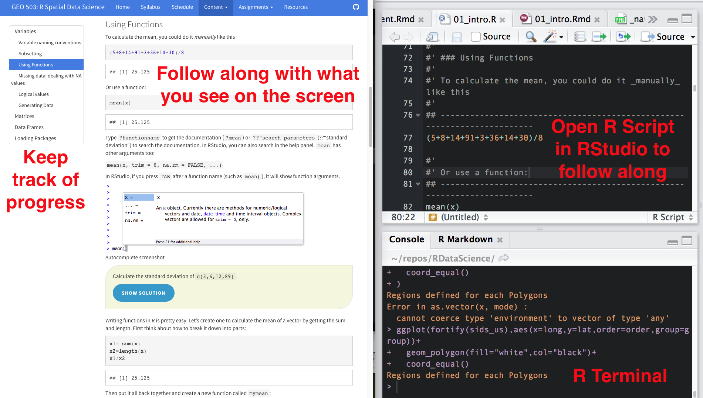

```{r setup, include=FALSE}
knitr::opts_chunk$set(echo = FALSE)
knitr::opts_chunk$set(cache=TRUE)
```

```{r message=F, warning=FALSE, results='hide'}
library(dplyr)
library(tidyr)
library(sp)
library(ggplot2)
library(rgeos)
library(maptools)
library(rgdal)
library(raster)
library(rasterVis)  #visualization library for raster
```

## Overview

- Spatial Objects
- Points
- Rasters
- Workflow

## Spatial objects
```{r,echo=FALSE,results='hide'}
coords = data.frame(
  x=rnorm(100),
  y=rnorm(100)
)
str(coords)
```

```{r, echo=TRUE}
sp = SpatialPoints(coords)
str(sp)
```

<!--  -->

## Rasters 
* Elevation (SRTM 90m resolution raster)
* World Climate (Tmin, Tmax, Precip, BioClim rasters)
* Countries from CIA factsheet (vector!)
* Global Administrative boundaries (vector!)


## Workflow

- Download a global Maximum Temperature dataset 
- Crop it to a country you download 
- Calculate the overall range for each variable 
- Calculate the focal median with an 11x11 window 
- Create a transect across the region and extract the temperature data.

## Using this tutorial



