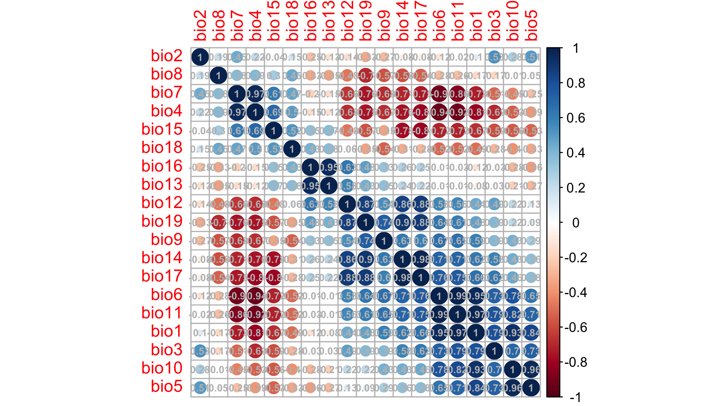
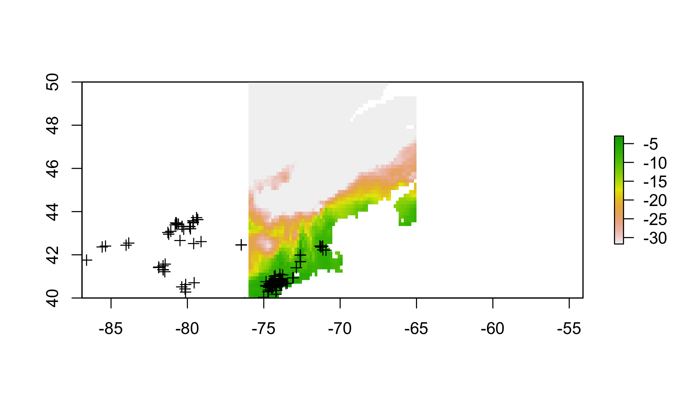

<!-- <div> -->
<!-- <iframe src="05_presentation/05_Spatial.html" width="100%" height="700px"> </iframe> -->
<!-- </div> -->

[<i class="fa fa-file-code-o fa-3x" aria-hidden="true"></i> The R Script associated with this page is available here](101SDMs.R).  Download this file and open it (or copy-paste into a new script) with RStudio so you can follow along.  

# Setup


```r
library(spocc)
library(raster)
library(sp)
library(rgdal)
library(ROCR)
library(corrplot)
```


# The worst SDM ever

The goal of this is to use the simplest possible set of operations to build an SDM. There are many packages that will perform much more refined versions of these steps, at the expense that decisions are made behind the scenes, or may be obscure to the user, especially if s/he is not big on reading help files. So before getting into the fancy tools, let's see what the bare minimum looks like.

> This is not the simplest possible code, because it requires some familiarity with the internal components of different spatial objects. The tradeoff is that none of the key operations are performed behind the scenes by specialized SDM functions. I realize this is not always pretty, but I hope for that reason it can demonstrate some coding gynmastics for beginners.


## Get data

```r
# get presence data
# pres=occ('Alliaria petiolata',from='gbif',limit=5000) # this can be slow
# so just read in the result of me running this earlier
#write.csv(pres$gbif$data[[1]],file='/Users/ctg/Dropbox/Projects/Workshops/YaleBGCCourses/101_assets/AP_gbif.csv')
pres=read.csv('~/Dropbox/Projects/Workshops/YaleBGCCourses/101_assets/AP_gbif.csv')[,c('longitude','latitude')]
pres=pres[complete.cases(pres),] # toss records without coords
# for direct download
# pres=read.csv('https://cmerow.github.io/YaleBGCCourses/101_assets/AP_gbif.csv')

# get climate data
clim=getData('worldclim', var='bio', res=10) 
```


##  Choose domain

```r
# choose domain (just the Eastern US)
clim.us=raster::crop(clim,c(-100,-50,25,50)) # trim to a smaller region
plot(clim.us) # view 
```

<!-- -->

The Bioclim variables in `clim.us` are:

<small>

Variable      Description
-    -
BIO1          Annual Mean Temperature
BIO2          Mean Diurnal Range (Mean of monthly (max temp – min temp))
BIO3          Isothermality (BIO2/BIO7) (* 100)
BIO4          Temperature Seasonality (standard deviation *100)
BIO5          Max Temperature of Warmest Month
BIO6          Min Temperature of Coldest Month
BIO7          Temperature Annual Range (BIO5-BIO6)
BIO8          Mean Temperature of Wettest Quarter
BIO9          Mean Temperature of Driest Quarter
BIO10         Mean Temperature of Warmest Quarter
BIO11         Mean Temperature of Coldest Quarter
BIO12         Annual Precipitation
BIO13         Precipitation of Wettest Month
BIO14         Precipitation of Driest Month
BIO15         Precipitation Seasonality (Coefficient of Variation)
BIO16         Precipitation of Wettest Quarter
BIO17         Precipitation of Driest Quarter
BIO18         Precipitation of Warmest Quarter
BIO19         Precipitation of Coldest Quarter

</small>


##  Prep data


```r
# check for correlated predictors
cors=cor(values(clim.us),use='complete.obs')
corrplot(cors,order = "AOE", addCoef.col = "grey",number.cex=.6)
```

<!-- -->


```r
clim=clim[[c('bio1','bio2','bio13','bio14')]]
clim.us=clim.us[[c('bio1','bio2','bio13','bio14')]]
cors=cor(values(clim.us),use='complete.obs')
corrplot(cors,order = "AOE", addCoef.col = "grey",number.cex=.6)
```

<!-- -->

Ok, tolerable.


```r
# scale each predictor to mean=0, variance=1
clim.means=apply(values(clim.us),2,mean,na.rm=T) # means
clim.sds=apply(values(clim.us),2,sd,na.rm=T) # standard devations
values(clim.us)=sapply(1:nlayers(clim.us),function(x) (values(clim.us)[,x]-clim.means[x])/clim.sds[x]) # z-scores

# get environment at pres points
coordinates(pres)=c('longitude','latitude') # set coords to allow extraction (next line)
pres.data=data.frame(raster::extract(clim.us,pres)) # extract data at pres locations
coordinates(pres.data)=coordinates(pres) # make sure the data have coords associated
pres.data=pres.data[complete.cases(pres.data@data),] # toss points without env data
```


##  Sample background

```r
# sample background (to compare against presences)
all.background=which(complete.cases(values(clim.us))) # find cells on land
bg.index=sample(all.background,10000) # take random sample of land
bg.data=data.frame(values(clim.us)[bg.index,]) # get the env at these cells
coordinates(bg.data)=coordinates(clim.us)[bg.index,] # define spatial object
```


```r
# prep data for use in glm()
all.data=rbind(data.frame(pres=1,pres.data@data),data.frame(pres=0,bg.data@data))

# specify formula (quickly to avoid writing out every name)
(form=paste('pres~', 
            paste(names(all.data)[-1], collapse = " + "),'+',
            paste("I(", names(all.data)[-1], "^2)", sep = "", collapse = " + ")))
```

```
## [1] "pres~ bio1 + bio2 + bio13 + bio14 + I(bio1^2) + I(bio2^2) + I(bio13^2) + I(bio14^2)"
```


## Statistical model


```r
# fit model
all.data$weight = all.data$pres + (1 - all.data$pres) * 100 # these allow you to fit a Point Process
mod.worst=glm(form,data=all.data,family=poisson(link='log'),weights=weight)
```

```
## Warning: glm.fit: fitted rates numerically 0 occurred
```

```r
summary(mod.worst)
```

```
## 
## Call:
## glm(formula = form, family = poisson(link = "log"), data = all.data, 
##     weights = weight)
## 
## Deviance Residuals: 
##     Min       1Q   Median       3Q      Max  
## -2.5855  -0.3526  -0.0762  -0.0086   4.5013  
## 
## Coefficients:
##             Estimate Std. Error z value Pr(>|z|)    
## (Intercept) -6.38136    0.09481 -67.306  < 2e-16 ***
## bio1         0.83602    0.11945   6.999 2.58e-12 ***
## bio2        -1.03475    0.08266 -12.518  < 2e-16 ***
## bio13       -1.81910    0.16570 -10.978  < 2e-16 ***
## bio14        0.87422    0.05456  16.023  < 2e-16 ***
## I(bio1^2)   -3.63591    0.22200 -16.378  < 2e-16 ***
## I(bio2^2)   -0.67464    0.06435 -10.484  < 2e-16 ***
## I(bio13^2)  -0.90681    0.14148  -6.410 1.46e-10 ***
## I(bio14^2)   0.38417    0.05821   6.599 4.13e-11 ***
## ---
## Signif. codes:  0 '***' 0.001 '**' 0.01 '*' 0.05 '.' 0.1 ' ' 1
## 
## (Dispersion parameter for poisson family taken to be 1)
## 
##     Null deviance: 11875.0  on 10837  degrees of freedom
## Residual deviance:  9571.7  on 10829  degrees of freedom
## AIC: 11266
## 
## Number of Fisher Scoring iterations: 13
```


## Inspect response curves


```r
# check response curves
  # these marginal response curves are evaluated at the means of the non-focal predictor
clim.ranges=apply(values(clim.us),2,range,na.rm=T) # upper and lower limits for each variable
dummy.mean.matrix=data.frame(matrix(0,ncol=nlayers(clim.us),nrow=100)) #makes prediction concise below
names(dummy.mean.matrix)=colnames(clim.ranges)
response.curves=lapply(1:nlayers(clim.us),function(x){ # loop over each variable
  xs=seq(clim.ranges[1,x],clim.ranges[2,x],length=100)
  newdata=dummy.mean.matrix
  newdata[,x]=xs
  ys=predict(mod.worst,newdata=newdata)
  return(data.frame(xs=xs,ys=ys)) # define outputs
})# ignore warnings
```


```r
str(response.curves)
```

```
## List of 4
##  $ :'data.frame':	100 obs. of  2 variables:
##   ..$ xs: num [1:100] -1.74 -1.7 -1.66 -1.62 -1.58 ...
##   ..$ ys: num [1:100] -18.9 -18.3 -17.8 -17.2 -16.7 ...
##  $ :'data.frame':	100 obs. of  2 variables:
##   ..$ xs: num [1:100] -4.31 -4.24 -4.17 -4.1 -4.03 ...
##   ..$ ys: num [1:100] -14.5 -14.1 -13.8 -13.5 -13.2 ...
##  $ :'data.frame':	100 obs. of  2 variables:
##   ..$ xs: num [1:100] -1.93 -1.86 -1.79 -1.71 -1.64 ...
##   ..$ ys: num [1:100] -6.25 -6.13 -6.02 -5.92 -5.84 ...
##  $ :'data.frame':	100 obs. of  2 variables:
##   ..$ xs: num [1:100] -1.84 -1.78 -1.72 -1.66 -1.6 ...
##   ..$ ys: num [1:100] -6.69 -6.72 -6.75 -6.77 -6.8 ...
```


```r
  # plot the curves
par(mfrow=c(4,5),mar=c(4,5,.5,.5))
for(i in 1:nlayers(clim)){
  plot(response.curves[[i]]$xs,response.curves[[i]]$ys,
       type='l',bty='n',las=1,xlab=colnames(clim.ranges)[i],ylab='occurence rate',ylim=c(-20,20))
}
```

<!-- -->


## Map predictions


```r
# predict to US
pred=predict(mod.worst,newdata=data.frame(values(clim.us)))
pred=pred/sum(pred,na.rm=T)
pred.r=clim.us[[1]] # dummy raster with right structure
values(pred.r)=pred 
plot(pred.r)
plot(pres,add=T)
```

<!-- -->


## Evaluate performance

```r
# evaluate
pred.at.fitting.pres=raster::extract(pred.r,pres.data)
pred.at.fitting.bg=raster::extract(pred.r,bg.data)
rocr.pred=ROCR::prediction(predictions=c(pred.at.fitting.pres,pred.at.fitting.bg),
                          labels=c(rep(1,length(pred.at.fitting.pres)),rep(0,length(pred.at.fitting.bg))))
perf.fit=performance(rocr.pred,measure = "tpr", x.measure = "fpr")
plot(perf.fit)
abline(0,1)
```

<!-- -->

```r
(auc_ROCR <- performance(rocr.pred, measure = "auc")@y.values[[1]])
```

```
## [1] 0.09439851
```

## Transfer to new conditions

```r
# transfer to Europe
# choose domain (just the europe)
clim.eu=raster::crop(clim,c(-10,55,30,75))
values(clim.eu)=sapply(1:nlayers(clim.eu),function(x) (values(clim.eu)[,x]-clim.means[x])/clim.sds[x]) # z-scores
transfer=predict(mod.worst,newdata=data.frame(values(clim.eu)))
transfer=transfer/sum(transfer,na.rm=T)
transfer.r=clim.eu[[1]]
values(transfer.r)=transfer
plot(transfer.r)
plot(pres,add=T)
```

<!-- -->

<!-- # # evaluate transfer -->
<!-- # pred.at.transfer.pres=raster::extract(transfer.r,pres.data) -->
<!-- #   # sample background in transfer region -->
<!-- # all.background=which(complete.cases(values(clim.us))) -->
<!-- # bg.index=sample(all.background,10000) -->
<!-- # bg.data=data.frame(values(clim.us)[bg.index,]) -->
<!-- # coordinates(bg.data)=coordinates(clim.us)[bg.index,] -->
<!-- #  -->
<!-- # transfer.bg= -->
<!-- # pred.at.fitting.bg=raster::extract(transfer.r,bg.data) -->
<!-- # rocr.pred=ROCR::prediction(predictions=c(pred.at.fitting.pres,pred.at.fitting.bg), -->
<!-- #                           labels=c(rep(1,length(pred.at.fitting.pres)),rep(0,length(pred.at.fitting.bg)))) -->
<!-- # perf.fit=performance(rocr.pred,measure = "tpr", x.measure = "fpr") -->
<!-- # plot(perf.fit) -->
<!-- # abline(0,1) -->
<!-- # (auc_ROCR <- performance(rocr.pred, measure = "auc")@y.values[[1]]) -->
<!-- #  -->


# Improvements

## Thin presences, Stratify sampling

## Sampling bias

## Model comparison

## Other algorithms: glmnet


