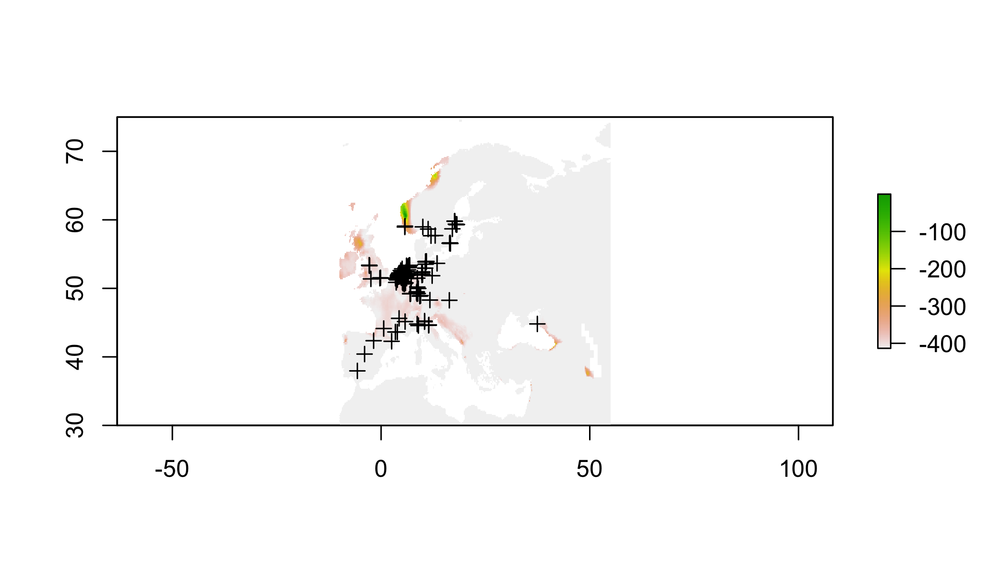

<!-- <div> -->
<!-- <iframe src="05_presentation/05_Spatial.html" width="100%" height="700px"> </iframe> -->
<!-- </div> -->

<div>
<object data="101_assets/SDM101_Intro.pdf" type="application/pdf" width="100%" height="600px"> 
  <p>It appears you don't have a PDF plugin for this browser.
   No biggie... you can <a href="02_assets/02_DataWrangling.pdf">click here to
  download the PDF file.</a></p>  
 </object>
 </div>
 <p><a href="101_assets/SDM101_Intro.pdf">Download the PDF of the presentation</a></p>  


[<i class="fa fa-file-code-o fa-3x" aria-hidden="true"></i> The R Script associated with this page is available here](101SDMs.R).  Download this file and open it (or copy-paste into a new script) with RStudio so you can follow along.  

# Setup


```r
library(spocc)
library(raster)
```

```
## Loading required package: sp
```

```r
library(sp)
library(rgdal)
```

```
## rgdal: version: 1.3-6, (SVN revision 773)
##  Geospatial Data Abstraction Library extensions to R successfully loaded
##  Loaded GDAL runtime: GDAL 2.1.3, released 2017/20/01
##  Path to GDAL shared files: /Library/Frameworks/R.framework/Versions/3.5/Resources/library/rgdal/gdal
##  GDAL binary built with GEOS: FALSE 
##  Loaded PROJ.4 runtime: Rel. 4.9.3, 15 August 2016, [PJ_VERSION: 493]
##  Path to PROJ.4 shared files: /Library/Frameworks/R.framework/Versions/3.5/Resources/library/rgdal/proj
##  Linking to sp version: 1.3-1
```

```r
library(ROCR)
```

```
## Loading required package: gplots
```

```
## 
## Attaching package: 'gplots'
```

```
## The following object is masked from 'package:stats':
## 
##     lowess
```

```r
library(corrplot)
```

```
## corrplot 0.84 loaded
```

```r
library(maxnet)
library(spThin)
```

```
## Loading required package: spam
```

```
## Loading required package: dotCall64
```

```
## Loading required package: grid
```

```
## Spam version 2.2-1 (2018-12-20) is loaded.
## Type 'help( Spam)' or 'demo( spam)' for a short introduction 
## and overview of this package.
## Help for individual functions is also obtained by adding the
## suffix '.spam' to the function name, e.g. 'help( chol.spam)'.
```

```
## 
## Attaching package: 'spam'
```

```
## The following objects are masked from 'package:base':
## 
##     backsolve, forwardsolve
```

```
## Loading required package: fields
```

```
## Loading required package: maps
```

```
## See www.image.ucar.edu/~nychka/Fields for
##  a vignette and other supplements.
```

```
## Loading required package: knitr
```


# The worst SDM ever

The goal of this section is to use the simplest possible set of operations to build an SDM. There are many packages that will perform much more refined versions of these steps, at the expense that decisions are made behind the scenes, or may be obscure to the user. So before getting into fancier tools, let's see what the bare minimum looks like.

> This is not the simplest possible code, because it requires some familiarity with the internal components of different spatial objects. The tradeoff is that none of the key operations are performed behind the scenes by specialized SDM functions. I realize this is not always pretty, but I hope for that reason it can demonstrate some coding gynmastics for beginners.


## Get presence data

The `spocc` package allows you to hit a number of the larger databases for presence-only data within R. They provide a number of useful pieces of metadata, if your'e into that sort of this. For this, we're not; we just want lat and lon.

> Decision: You assume the database of choice has sufficiently checked for errors in biology or typos. You know what happens when you assume...


```r
# get presence data
# pres=spocc::occ('Alliaria petiolata',from='gbif',limit=5000) # this can be slow
  # so just read in the result of me running this earlier
pres=read.csv('https://cmerow.github.io/YaleBGCCourses/101_assets/AP_gbif.csv')[,c('longitude','latitude')]
pres=pres[complete.cases(pres),] # toss records without coords
```


## Get environmental data

The `raster` package has a convenience function to get some types of data. To see more about [Worldclim](http://worldclim.org/version2)

> Decision: Worldclim data describes the environmental well in this region. The 'bioclim' variables are biologically relevant summaries of climate.


```r
# get climate data
  # the raster package has convenience function built in for worldclim
clim=getData('worldclim', var='bio', res=10)
```

The Bioclim variables in `clim.us` are:

<small>

Variable      Description
-    -
BIO1          Annual Mean Temperature
BIO2          Mean Diurnal Range (Mean of monthly (max temp – min temp))
BIO3          Isothermality (BIO2/BIO7) (* 100)
BIO4          Temperature Seasonality (standard deviation *100)
BIO5          Max Temperature of Warmest Month
BIO6          Min Temperature of Coldest Month
BIO7          Temperature Annual Range (BIO5-BIO6)
BIO8          Mean Temperature of Wettest Quarter
BIO9          Mean Temperature of Driest Quarter
BIO10         Mean Temperature of Warmest Quarter
BIO11         Mean Temperature of Coldest Quarter
BIO12         Annual Precipitation
BIO13         Precipitation of Wettest Month
BIO14         Precipitation of Driest Month
BIO15         Precipitation Seasonality (Coefficient of Variation)
BIO16         Precipitation of Wettest Quarter
BIO17         Precipitation of Driest Quarter
BIO18         Precipitation of Warmest Quarter
BIO19         Precipitation of Coldest Quarter

</small>


##  Choose domain

The 'domain' is the region of interest. It can be a political region, a biome, a park, a watershed, etc. It should include locations where the species is present and absent. Choosing relevent locations were the species does not occur is part of the art of *presence-only* modeling (see slides above).

> Decision: We are only asking about invasion in New England, so we constrain the domain to a bounding box around New England


```r
# choose domain (just the Eastern US)
clim.us=raster::crop(clim,c(-76,-65,40,50)) # trim to a smaller region
plot(clim.us[[1]]) # plot just the 1st variable to see domain
```

<!-- -->

##  Prep data

Many climate variables are highly correlated with one another, which can confound statistical analyses.

> Decision: Correlated predictors can make it difficult to interpret model coefficients or response curves. So we'll remove the most correlated predictores


```r
# check for correlated predictors
cors=cor(values(clim.us),use='complete.obs') # evaluate correlations
corrplot(cors,order = "AOE", addCoef.col = "grey",number.cex=.6) # plot correlations
```

<!-- -->

This plot nicely clumps groups of similar variables. Choose a representative variable from each clump.


```r
clim=clim[[c("bio1","bio2","bio13","bio14")]] # keep just reasonably uncorrelated ones
clim.us=clim.us[[c('bio1','bio2','bio13','bio14')]] # keep just reasonably uncorrelated ones
cors=cor(values(clim.us),use='complete.obs') # evaluate correlations
corrplot(cors,order = "AOE", addCoef.col = "grey",number.cex=.6)# plot correlations
```

<!-- -->

Ok, tolerable. Some people advocate that correlations should be <0.7. I prefer lower, like 0.3, or 0.4 because I often forecast (as we'll do below) and one must assume that those correlations hold in new scenarios hold to make meaningful forecasts.

Scaling each predictor to zero mean and unit variance is a common statistical approach to make sure the coefficents you'll estimate are comparable (on the same scale) and prevents a few other wonky things from possibly happening.


```r
# scale each predictor to mean=0, variance=1
clim.means=apply(values(clim.us),2,mean,na.rm=T) # means
clim.sds=apply(values(clim.us),2,sd,na.rm=T) # standard devations
name=names(clim.us)
values(clim.us)=sapply(1:nlayers(clim.us),function(x) (values(clim.us)[,x]-clim.means[x])/clim.sds[x]) 
# z-scores
names(clim.us)=name

# get environment at pres points
coordinates(pres)=c('longitude','latitude') # set coords to allow extraction (next line)
pres.data=data.frame(raster::extract(clim.us,pres)) # extract data at pres locations
coordinates(pres.data)=coordinates(pres) # make sure the data have coords associated
pres.data=pres.data[complete.cases(pres.data@data),] # toss points without env data
```


```r
plot(clim.us) # view 
```

<!-- -->

##  Sample background

In presence-only (PO) modeling, where absence data do not exist, so-called 'background' (==jargon) points are used. In PO models, one compares the environmental conditions at occupied locations (presences) to the conditions available in the region of interest. This corresponds to 'use-avialability' (==jargon) analysis and asks, 'how much does the species use environment x in proportion to its availability?' For example, if a landscape contains 10 cells with temperature < 20 degrees, and the species uses all of them, you would infer that cold locations are important (10 are used and 10 are available). In contrast, if the lanscape had 1000 cells with temperature <20 degrees, you'd infer the opposite, that cold cells are probably avoided (10 are used and 1000 are available). This is the essence of (this type of) presence-only modeling.

> Decision: The species is equally likely to be anywhere on the landscapes, so we'll compare presences to a random sample of background points.

(There's a lot of subtlties about background selection, just go with it for now...)


```r
	## save the data table
# sample background (to compare against presences)
all.background=which(complete.cases(values(clim.us))) # find cells on land
bg.index=sample(all.background,min(length(all.background),10000)) # take random sample of land
bg.data=data.frame(values(clim.us)[bg.index,]) # get the env at these cells
coordinates(bg.data)=coordinates(clim.us)[bg.index,] # define spatial object
```

## Statistical model

> Decision: Linear and quadratic terms are sufficient to describe the species' response to the environment. 

Next, combine the data into a convenient form and specify a formula for the regression.


```r
# prep data for use in glm()
all.data=rbind(data.frame(pres=1,pres.data@data),data.frame(pres=0,bg.data@data)) # line up pres & bg

# specify formula (quickly to avoid writing out every name)
(form=paste('pres/weight~', # lhs of eqn.
            paste(names(all.data)[-1], collapse = " + "),'+', # linear terms
            paste("I(", names(all.data)[-1], "^2)", sep = "", collapse = " + "))) # qudratic terms
```

```
## [1] "pres/weight~ bio1 + bio2 + bio13 + bio14 + I(bio1^2) + I(bio2^2) + I(bio13^2) + I(bio14^2)"
```

There are some subtle differences here compared to a regular old GLM. These weights allow one to fit a Poisson point process model with the `glm` function. If this sort of thing excites you, [this paper](http://onlinelibrary.wiley.com/doi/10.1111/2041-210X.12352/abstract)
describes point process models well, and the appendix describes this weighting scheme. If it doesn't, just pretend this is a regular GLM for now. 


```r
all.data$weight = all.data$pres + (1 - all.data$pres) * 10000 # these allow you to fit a Point Process
mod.worst=glm(form,data=all.data,family=poisson(link='log'),weights=weight) # fit the model
summary(mod.worst) # show coefficients
```

```
## 
## Call:
## glm(formula = form, family = poisson(link = "log"), data = all.data, 
##     weights = weight)
## 
## Deviance Residuals: 
##     Min       1Q   Median       3Q      Max  
## -4.0280  -0.2408  -0.0706  -0.0308   5.1147  
## 
## Coefficients:
##              Estimate Std. Error z value Pr(>|z|)    
## (Intercept) -15.37924    0.30294 -50.766  < 2e-16 ***
## bio1          2.58714    0.30915   8.369  < 2e-16 ***
## bio2          0.88788    0.07252  12.243  < 2e-16 ***
## bio13         0.32046    0.09170   3.495 0.000475 ***
## bio14        -0.96095    0.09545 -10.067  < 2e-16 ***
## I(bio1^2)     0.21355    0.10382   2.057 0.039705 *  
## I(bio2^2)     0.23243    0.03706   6.272 3.57e-10 ***
## I(bio13^2)    0.22246    0.06308   3.526 0.000421 ***
## I(bio14^2)    0.41497    0.05867   7.073 1.52e-12 ***
## ---
## Signif. codes:  0 '***' 0.001 '**' 0.01 '*' 0.05 '.' 0.1 ' ' 1
## 
## (Dispersion parameter for poisson family taken to be 1)
## 
##     Null deviance: 8340.1  on 3353  degrees of freedom
## Residual deviance: 6823.3  on 3345  degrees of freedom
## AIC: 7579.3
## 
## Number of Fisher Scoring iterations: 17
```


## Inspect response curves

Response curves describe how the species' occurrence (y-axis) depends on a single climate variable (x-axis). There's one for each environmental variable in the model. Usually this is done by making predictions with all the other predictors set at their means. Most packages have 1-liners to make this instead, but this builds more character.


```r
# check response curves
  # these marginal response curves are evaluated at the means of the non-focal predictor
clim.ranges=apply(values(clim.us),2,range,na.rm=T) # upper and lower limits for each variable
dummy.mean.matrix=data.frame(matrix(0,ncol=nlayers(clim.us),nrow=100)) #makes prediction concise below
names(dummy.mean.matrix)=colnames(clim.ranges) # line up names for later reference
response.curves=lapply(1:nlayers(clim.us),function(x){ # loop over each variable
  xs=seq(clim.ranges[1,x],clim.ranges[2,x],length=100) # x values to evaluate the curve
  newdata=dummy.mean.matrix # data frame with right structure
  newdata[,x]=xs # plug in just the values for the focal variable that differ from mean
  ys=predict(mod.worst,newdata=newdata) # predictions
  return(data.frame(xs=xs,ys=ys)) # define outputs
})# ignore warnings
```

Check out the list of lists that store this.


```r
str(response.curves) #structure of the object used for plotting
```

```
## List of 4
##  $ :'data.frame':	100 obs. of  2 variables:
##   ..$ xs: num [1:100] -1.79 -1.74 -1.7 -1.65 -1.61 ...
##   ..$ ys: num [1:100] -19.3 -19.2 -19.2 -19.1 -19 ...
##  $ :'data.frame':	100 obs. of  2 variables:
##   ..$ xs: num [1:100] -4.75 -4.68 -4.61 -4.54 -4.47 ...
##   ..$ ys: num [1:100] -14.3 -14.4 -14.5 -14.6 -14.7 ...
##  $ :'data.frame':	100 obs. of  2 variables:
##   ..$ xs: num [1:100] -2.82 -2.76 -2.7 -2.64 -2.58 ...
##   ..$ ys: num [1:100] -14.5 -14.6 -14.6 -14.7 -14.7 ...
##  $ :'data.frame':	100 obs. of  2 variables:
##   ..$ xs: num [1:100] -2.52 -2.46 -2.4 -2.34 -2.28 ...
##   ..$ ys: num [1:100] -10.3 -10.5 -10.7 -10.9 -11 ...
```


```r
  # plot the curves
par(mfrow=c(2,2),mar=c(4,5,.5,.5)) # # rows and cols for plotting
for(i in 1:nlayers(clim.us)){ # loop over layers
  plot(response.curves[[i]]$xs,response.curves[[i]]$ys, # xs and ys
       type='l', # line plot
       bty='n',las=1, # decorations
       ylim=c(-20,20), # y axis limits
       xlab=colnames(clim.ranges)[i],ylab='occurence rate') # axis labels
  pres.env.range=range(pres.data[names(clim.us)[i]]@data)  # find limits of fitting data
  abline(v=pres.env.range,col='red',lty=2)  # plot limits of fitting data
}
```

<!-- -->


## Map predictions

> Decision: When predicting, its ok to extrapolate beyond 


```r
# predict to US
pred.r=raster::predict(clim.us,mod.worst, index=1,type="response")
pred.r=pred.r/sum(values(pred.r),na.rm=T) # normalize prediction (sum to 1)
plot(log(pred.r)) # plot raster
plot(pres,add=T) # plot points
```

<!-- -->


## Evaluate performance

Reciever-operator characteristic (ROC) curves are often used to evaluation binary (presence/absence) predictions. Since the predictions are continuous (see previous map), we need to choose a threshold that distinguishes presence from absence. The ROC curve summarizes the results for all possible thresholds. Each point corresponds to a threshold, the y-axis describes the proportion of presences correctly predicted while the x-axis describes the proportion of background points where presence is predicted. There's a clear tradeoff in getting a lot of presences right without predicting presence everywhere. The AUC (area under the curve) describes the area under the ROC curve - a value of 1 is the best, and a value of 0.5 means you may as well flip a coin. More [here](https://en.wikipedia.org/wiki/Receiver_operating_characteristic).


```r
# evaluate
pred.at.fitting.pres=raster::extract(pred.r,pres.data) # get predictions at pres locations
pred.at.fitting.bg=raster::extract(pred.r,bg.data) # get predictions at background locations
rocr.pred=ROCR::prediction(predictions=c(pred.at.fitting.pres,pred.at.fitting.bg),
                          labels=c(rep(1,length(pred.at.fitting.pres)),rep(0,length(pred.at.fitting.bg)))) # define the prediction object needed by ROCR
perf.fit=performance(rocr.pred,measure = "tpr", x.measure = "fpr") # calculate perfomance 
plot(perf.fit) # plot ROC curve
abline(0,1) # 1:1 line indicate random predictions 
```

<!-- -->

```r
(auc_ROCR <- performance(rocr.pred, measure = "auc")@y.values[[1]]) # get AUC
```

```
## [1] 0.9412932
```

## Transfer to new conditions

A common goal of SDMing is to transfer the models to new locations.

> Decision: The occurrence-environment relationship fit in New England also describes the species response to environment in Europe.


```r
# transfer to Europe
# choose domain (just europe)
clim.eu=raster::crop(clim,c(-10,55,30,75))
values(clim.eu)=sapply(1:nlayers(clim.eu),function(x) (values(clim.eu)[,x]-clim.means[x])/clim.sds[x])
names(clim.eu)=names(clim.us)
# z-scores (to make values comparable to the scaeld values for fitting)
transfer.r=raster::predict(clim.eu,mod.worst, index=1,type="response")
transfer.r=transfer.r/sum(values(transfer.r),na.rm=T) # normalize prediction (sum to 1)
plot(log(transfer.r)) # plot preds
plot(pres,add=T) # plot presences 
```

<!-- -->


# Improvements

<!-- #========================================================================= -->
## Sampling bias

###  Sample background


> Decision: Presences are most likely to be observed where other specie sampled with the same protocol or are taxonomically similar were sampled. 

The data in `bias.bg` are the result of extracting the coordinates of all 187 species observed in the Invasive Plant Atlas of New England (IPANE) data base.


```r
bias.bg=read.csv('https://cmerow.github.io/YaleBGCCourses/101_assets/Bias_IPANE_allPoints.csv')[,-1]
coordinates(bias.bg)=c(1,2)
bias.bg.data=data.frame(raster::extract(clim.us,bias.bg))
coordinates(bias.bg.data)=coordinates(bias.bg)
bias.bg.data=bias.bg.data[complete.cases(bias.bg.data@data),]
```


```r
# prep data for use in glm()
all.data=rbind(data.frame(pres=1,pres.data@data),data.frame(pres=0,bias.bg.data@data))

# specify formula (quickly to avoid writing out every name)
(form=paste('pres/weight~', # lhs of eqn.
            paste(names(all.data)[-1], collapse = " + "),'+', # linear terms
            paste("I(", names(all.data)[-1], "^2)", sep = "", collapse = " + "))) # qudratic terms
```

```
## [1] "pres/weight~ bio1 + bio2 + bio13 + bio14 + I(bio1^2) + I(bio2^2) + I(bio13^2) + I(bio14^2)"
```

*From this point on, the code is exactly the same as the previous example, except that the model is given a new name, `mod.bias` instead of `mod.worst`*

## Statistical model


```r
all.data$weight = all.data$pres + (1 - all.data$pres) * 10000 # these allow you to fit a Point Process
mod.bias=glm(form,data=all.data,family=poisson(link='log'),weights=weight) # fit the model
summary(mod.bias) # show coefficients
```

```
## 
## Call:
## glm(formula = form, family = poisson(link = "log"), data = all.data, 
##     weights = weight)
## 
## Deviance Residuals: 
##     Min       1Q   Median       3Q      Max  
## -1.7729  -0.2560  -0.1099  -0.0320   6.3131  
## 
## Coefficients:
##              Estimate Std. Error z value Pr(>|z|)    
## (Intercept) -17.31494    0.28372 -61.028  < 2e-16 ***
## bio1         -5.04764    0.31736 -15.905  < 2e-16 ***
## bio2          2.59214    0.07989  32.446  < 2e-16 ***
## bio13         1.15896    0.09228  12.560  < 2e-16 ***
## bio14        -2.61444    0.07388 -35.389  < 2e-16 ***
## I(bio1^2)     5.08107    0.12202  41.641  < 2e-16 ***
## I(bio2^2)     0.66814    0.05442  12.277  < 2e-16 ***
## I(bio13^2)    0.79904    0.10116   7.899 2.81e-15 ***
## I(bio14^2)   -0.08801    0.08161  -1.078    0.281    
## ---
## Signif. codes:  0 '***' 0.001 '**' 0.01 '*' 0.05 '.' 0.1 ' ' 1
## 
## (Dispersion parameter for poisson family taken to be 1)
## 
##     Null deviance: 8805.4  on 5976  degrees of freedom
## Residual deviance: 5167.8  on 5968  degrees of freedom
## AIC: 5923.8
## 
## Number of Fisher Scoring iterations: 18
```


## Inspect response curves


```r
# check response curves
  # these marginal response curves are evaluated at the means of the non-focal predictor
clim.ranges=apply(values(clim.us),2,range,na.rm=T) # upper and lower limits for each variable
dummy.mean.matrix=data.frame(matrix(0,ncol=nlayers(clim.us),nrow=100)) #makes prediction concise below
names(dummy.mean.matrix)=colnames(clim.ranges) # line up names for later reference
response.curves=lapply(1:nlayers(clim.us),function(x){ # loop over each variable
  xs=seq(clim.ranges[1,x],clim.ranges[2,x],length=100) # x values to evaluate the curve
  newdata=dummy.mean.matrix # data frame with right structure
  newdata[,x]=xs # plug in just the values for the focal variable that differ from mean
  ys=predict(mod.bias,newdata=newdata) # predictions
  return(data.frame(xs=xs,ys=ys)) # define outputs
})# ignore warnings
```


```r
str(response.curves) #structure of the object used for plotting
```

```
## List of 4
##  $ :'data.frame':	100 obs. of  2 variables:
##   ..$ xs: num [1:100] -1.79 -1.74 -1.7 -1.65 -1.61 ...
##   ..$ ys: num [1:100] 7.92 6.89 5.88 4.89 3.92 ...
##  $ :'data.frame':	100 obs. of  2 variables:
##   ..$ xs: num [1:100] -4.75 -4.68 -4.61 -4.54 -4.47 ...
##   ..$ ys: num [1:100] -14.5 -14.8 -15.1 -15.3 -15.6 ...
##  $ :'data.frame':	100 obs. of  2 variables:
##   ..$ xs: num [1:100] -2.82 -2.76 -2.7 -2.64 -2.58 ...
##   ..$ ys: num [1:100] -14.2 -14.4 -14.6 -14.8 -15 ...
##  $ :'data.frame':	100 obs. of  2 variables:
##   ..$ xs: num [1:100] -2.52 -2.46 -2.4 -2.34 -2.28 ...
##   ..$ ys: num [1:100] -11.3 -11.4 -11.6 -11.7 -11.8 ...
```


```r
  # plot the curves
par(mfrow=c(2,2),mar=c(4,5,.5,.5)) # # rows and cols for plotting
for(i in 1:nlayers(clim.us)){ # loop over layers
  plot(response.curves[[i]]$xs,response.curves[[i]]$ys,
       type='l',bty='n',las=1,xlab=colnames(clim.ranges)[i],ylab='occurence rate',ylim=c(-20,20))
  pres.env.range=range(pres.data[names(clim.us)[i]]@data) # find limits of fitting data
  abline(v=pres.env.range,col='red',lty=2) # plot limits of fitting data
}
```

<!-- -->


### Map predictions


```r
# predict to US
pred.r=raster::predict(clim.us,mod.bias, index=1,type="response")
pred.r=pred.r/sum(values(pred.r),na.rm=T) # normalize prediction (sum to 1)
plot(log(pred.r)) # plot raster
plot(pres,add=T) # plot points
```

<!-- -->


### Evaluate performance

```r
# evaluate
pred.at.fitting.pres=raster::extract(pred.r,pres.data) # get predictions at pres locations
pred.at.fitting.bg=raster::extract(pred.r,bg.data) # get predictions at background locations
rocr.pred=ROCR::prediction(predictions=c(pred.at.fitting.pres,pred.at.fitting.bg),
                          labels=c(rep(1,length(pred.at.fitting.pres)),rep(0,length(pred.at.fitting.bg)))) # define the prediction object needed by ROCR
perf.fit=performance(rocr.pred,measure = "tpr", x.measure = "fpr") # calculate perfomance 
plot(perf.fit) # plot ROC curve
abline(0,1) # 1:1 line indicate random predictions 
```

<!-- -->

```r
(auc_ROCR <- performance(rocr.pred, measure = "auc")@y.values[[1]]) # get AUC
```

```
## [1] 0.6737413
```

Oh, Snap! Not nearly as good as the model that ignored bias. This is common when accounting for bias; you've removed something that structured the observations from the model. So you evaluation on the *fitting* data will be worse. Performance on new data sets will often be better (conditional on the rest of the model being well designed), so long as those don't suffer from the same sampling bias patterns.

<!-- #========================================================================= -->
<!-- #========================================================================= -->
## Other algorithms: glmnet

## Statistical model


```r
mod.maxnet=maxnet(p=all.data[,'pres'],data=all.data[,c("bio1","bio2","bio13","bio14")])
summary(mod.maxnet) # show coefficients
```

```
##                Length Class     Mode     
## a0               200  -none-    numeric  
## beta           81200  dgCMatrix S4       
## df               200  -none-    numeric  
## dim                2  -none-    numeric  
## lambda           200  -none-    numeric  
## dev.ratio        200  -none-    numeric  
## nulldev            1  -none-    numeric  
## npasses            1  -none-    numeric  
## jerr               1  -none-    numeric  
## offset             1  -none-    logical  
## classnames         2  -none-    character
## call               8  -none-    call     
## nobs               1  -none-    numeric  
## betas             24  -none-    numeric  
## alpha              1  -none-    numeric  
## entropy            1  -none-    numeric  
## penalty.factor   406  -none-    numeric  
## featuremins      406  -none-    numeric  
## featuremaxs      406  -none-    numeric  
## varmin             4  -none-    numeric  
## varmax             4  -none-    numeric  
## samplemeans        4  -none-    list     
## levels             4  -none-    list
```

*From this point on, the code is exactly the same as the previous example, except that the model is given a new name, `mod.maxnet` instead of `mod.bias`*

## Inspect response curves


```r
# check response curves
  # these marginal response curves are evaluated at the means of the non-focal predictor
clim.ranges=apply(values(clim.us),2,range,na.rm=T) # upper and lower limits for each variable
dummy.mean.matrix=data.frame(matrix(0,ncol=nlayers(clim.us),nrow=100)) #makes prediction concise below
names(dummy.mean.matrix)=colnames(clim.ranges) # line up names for later reference
response.curves=lapply(1:nlayers(clim.us),function(x){ # loop over each variable
  xs=seq(clim.ranges[1,x],clim.ranges[2,x],length=100) # x values to evaluate the curve
  newdata=dummy.mean.matrix # data frame with right structure
  newdata[,x]=xs # plug in just the values for the focal variable that differ from mean
  ys=predict(mod.maxnet,newdata=newdata) # predictions
  return(data.frame(xs=xs,ys=ys)) # define outputs
})# ignore warnings
```


```r
  # plot the curves
par(mfrow=c(2,2),mar=c(4,5,.5,.5)) # # rows and cols for plotting
for(i in 1:nlayers(clim.us)){ # loop over layers
  plot(response.curves[[i]]$xs,response.curves[[i]]$ys,
       type='l',bty='n',las=1,xlab=colnames(clim.ranges)[i],ylab='occurence rate',ylim=c(-20,20))
  pres.env.range=range(pres.data[names(clim.us)[i]]@data)  # find limits of fitting data
  abline(v=pres.env.range,col='red',lty=2)  # plot limits of fitting data
}
```

<!-- -->


### Map predictions


```r
# predict to US
pred.r=raster::predict(clim.us,mod.maxnet, index=1,type="exponential") # note 'type' differs from glm
pred.r=pred.r/sum(values(pred.r),na.rm=T) # normalize prediction (sum to 1)
plot(log(pred.r)) # plot raster
plot(pres,add=T) # plot points
```

<!-- -->


### Evaluate performance

```r
# evaluate
pred.at.fitting.pres=raster::extract(pred.r,pres.data) # get predictions at pres locations
pred.at.fitting.bg=raster::extract(pred.r,bg.data) # get predictions at background locations
rocr.pred=ROCR::prediction(predictions=c(pred.at.fitting.pres,pred.at.fitting.bg),
                          labels=c(rep(1,length(pred.at.fitting.pres)),rep(0,length(pred.at.fitting.bg)))) # define the prediction object needed by ROCR
perf.fit=performance(rocr.pred,measure = "tpr", x.measure = "fpr") # calculate perfomance 
plot(perf.fit) # plot ROC curve
abline(0,1) # 1:1 line indicate random predictions 
```

<!-- -->

```r
(auc_ROCR <- performance(rocr.pred, measure = "auc")@y.values[[1]]) # get AUC
```

```
## [1] 0.789735
```

Great, we've recovered some of the predictive accuracy lost when the sampling bias was factored out. By picking up more complex responses, we're better able to describe the distribution. An important caveat is that we should check for overfitting, wherein we've fit to idiosyncracies of the particular fitting data set. To check this, we'd need to evaluate on independent data, which we won't get to here *but is a critical step on any SDM you intend to publish.*

## Other options

Within the framework described above:

* Thin presences to remove spatial autocorrelation
* Subsample presences to evaluate model on independent data (e.g., k-fold cross validation)
* Use remotely sensed data (removing artefacts of interpolation)
* More informative performance statistics (Boyce, partial AUC)
* Other algorithms (GAMs, Tree-based methods, Envelope methods)
* Model selection to find better suites of predictors

Somewhat different frameworks:

* Model space explicitly (accounting for spatial autocorrelation)
* Borrow strength from other species (Joint SDMs)
* Bayesian models for more complete treatment of uncertainty or hierarchical structure, among other things
* Ensemble approaches to combine the results of multiple models
* Combine data from different parts of the distribution (e.g. native range)
<!-- #========================================================================= -->
<!-- ## Thin presences, Stratify sampling -->

<!-- ```{r} -->
<!-- all.data$weight = all.data$pres + (1 - all.data$pres) * 10000 # these allow you to fit a Point Process -->
<!-- mod.worst=glm(form,data=all.data,family=poisson(link='log'),weights=weight) # fit the model -->
<!-- #mod.worst=maxnet(all.data$pres,all.data[-1]) -->
<!-- summary(mod.worst) # show coefficients -->
<!-- ``` -->


<!-- ## Model Comparison -->
<!-- # # evaluate transfer -->
<!-- # pred.at.transfer.pres=raster::extract(transfer.r,pres.data) -->
<!-- #   # sample background in transfer region -->
<!-- # all.background=which(complete.cases(values(clim.us))) -->
<!-- # bg.index=sample(all.background,10000) -->
<!-- # bg.data=data.frame(values(clim.us)[bg.index,]) -->
<!-- # coordinates(bg.data)=coordinates(clim.us)[bg.index,] -->
<!-- #  -->
<!-- # transfer.bg= -->
<!-- # pred.at.fitting.bg=raster::extract(transfer.r,bg.data) -->
<!-- # rocr.pred=ROCR::prediction(predictions=c(pred.at.fitting.pres,pred.at.fitting.bg), -->
<!-- #                           labels=c(rep(1,length(pred.at.fitting.pres)),rep(0,length(pred.at.fitting.bg)))) -->
<!-- # perf.fit=performance(rocr.pred,measure = "tpr", x.measure = "fpr") -->
<!-- # plot(perf.fit) -->
<!-- # abline(0,1) -->
<!-- # (auc_ROCR <- performance(rocr.pred, measure = "auc")@y.values[[1]]) -->
<!-- #  -->

