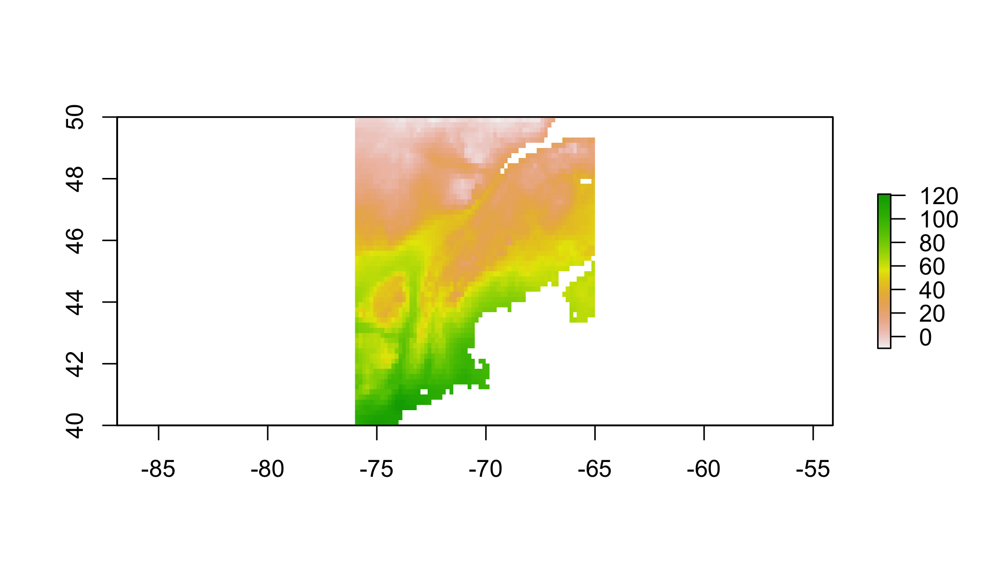
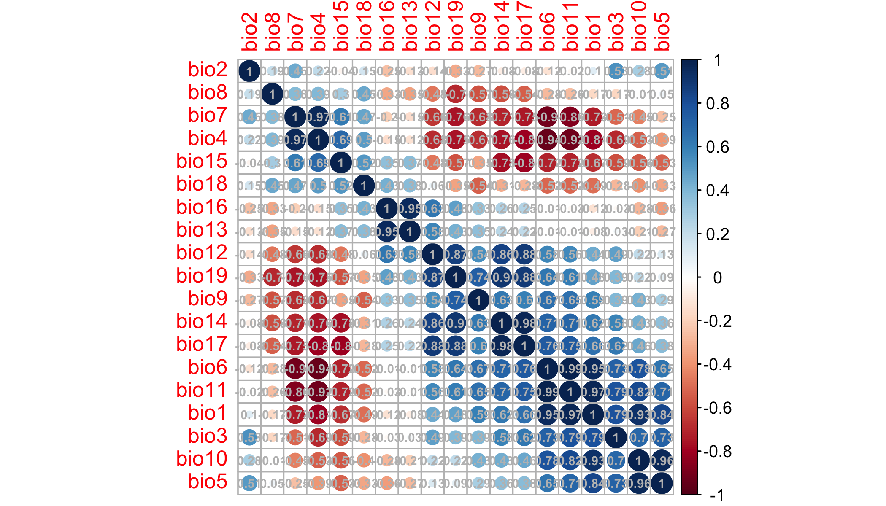
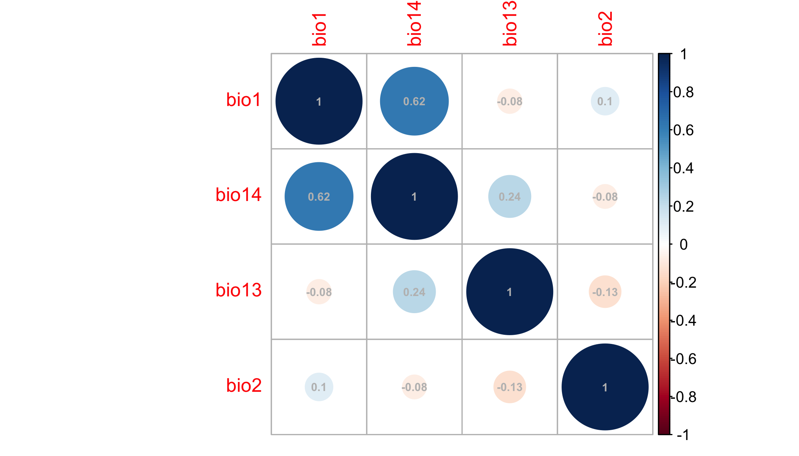
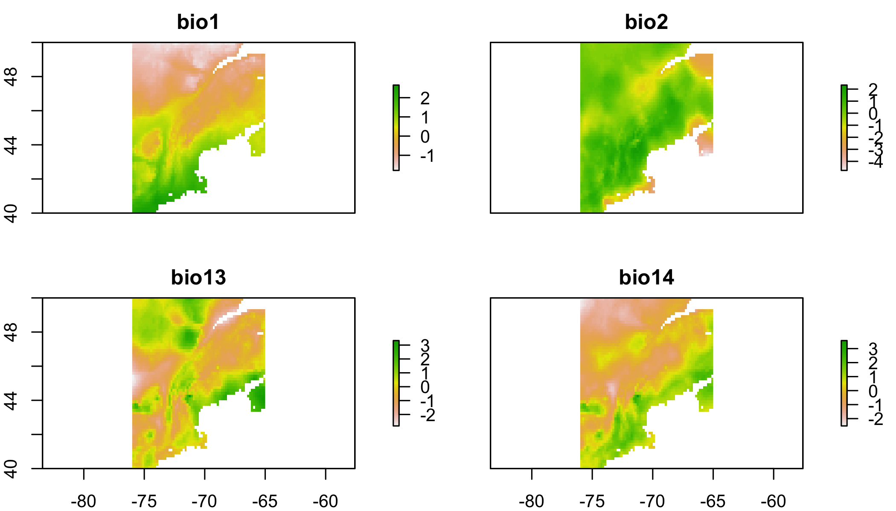
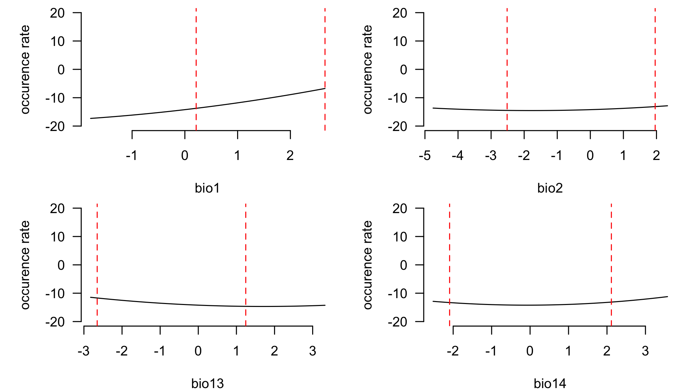
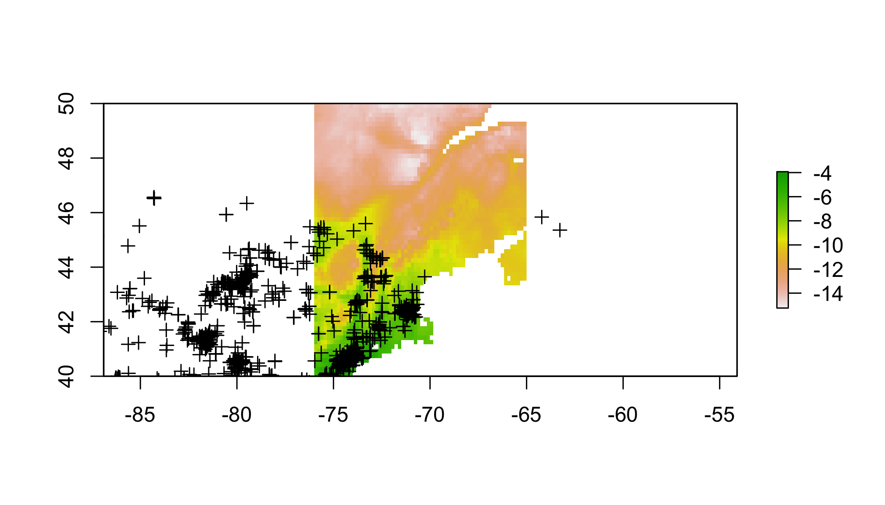
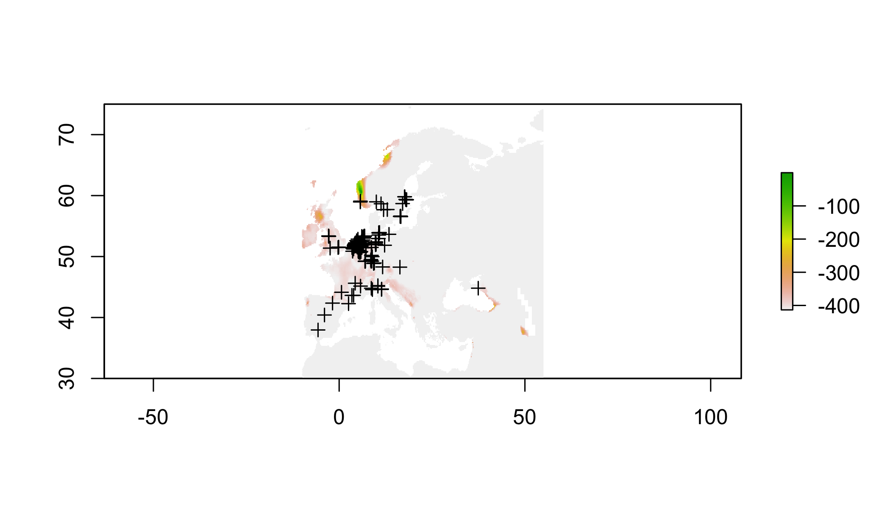
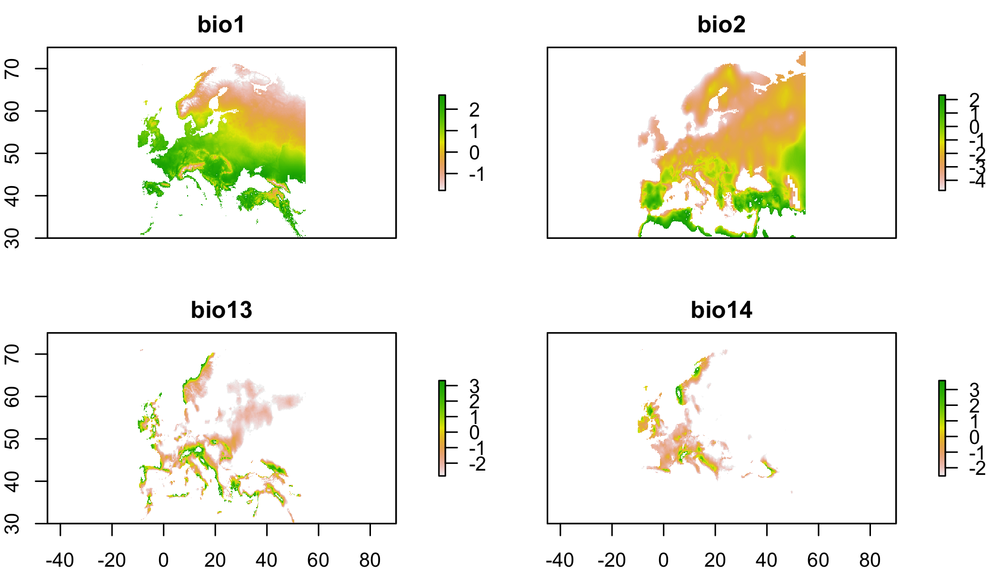
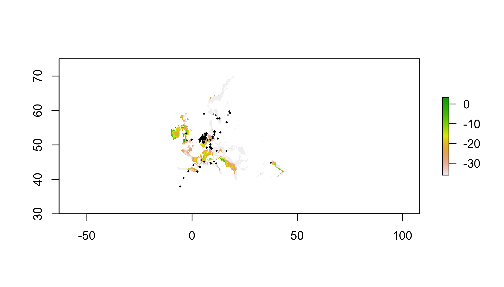
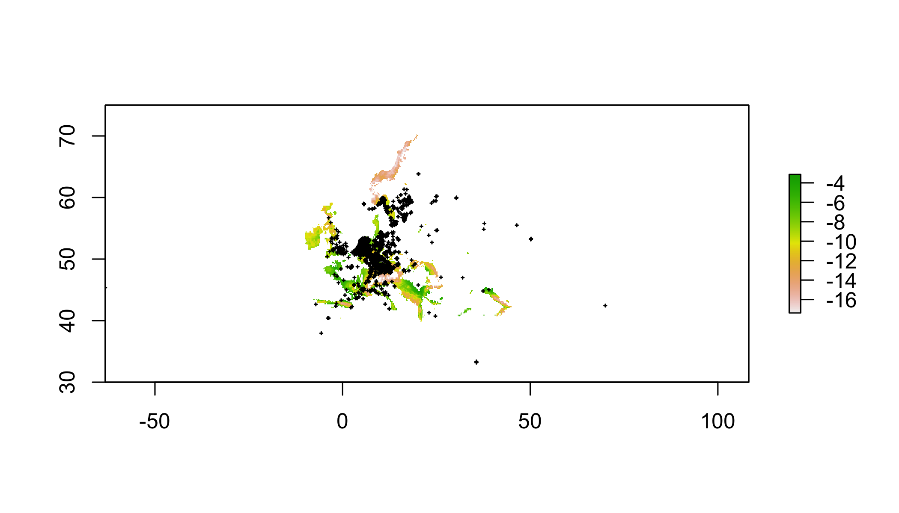

<!-- <div> -->
<!-- <iframe src="05_presentation/05_Spatial.html" width="100%" height="700px"> </iframe> -->
<!-- </div> -->

<div>
<object data="111_assets/SDM_Transfer.pdf" type="application/pdf" width="100%" height="600px"> 
  <p>It appears you don't have a PDF plugin for this browser.
   No biggie... you can <a href="111_assets/SDM_Transfer.pdf">click here to
  download the PDF file.</a></p>  
 </object>
 </div>
 <p><a href="101_assets/SDM101_Intro.pdf">Download the PDF of the presentation</a></p>  


[<i class="fa fa-file-code-o fa-3x" aria-hidden="true"></i> The R Script associated with this page is available here](111_SDM_Transfer.R).  Download this file and open it (or copy-paste into a new script) with RStudio so you can follow along.  

# Setup


```r
library(spocc)
library(raster)
library(sp)
library(rgdal)
library(ROCR)
library(corrplot)
library(maxnet)
library(spThin)
```


# A simple SDM

The goal of this section is to use a simple set of operations to build an SDM. There are many packages that will perform much more refined versions of these steps, at the expense that decisions are made behind the scenes, or may be obscure to the user. So before getting into fancier tools, let's see what the bare minimum looks like.

## Get presence data

The `spocc` package allows you to hit a number of the larger databases for presence-only data within R. They provide a number of useful pieces of metadata, if your'e into that sort of this. For this, we're not; we just want lat and lon.

> Decision: You assume the database of choice has sufficiently checked for errors in biology or typos. You know what happens when you assume...


```r
# get presence data
pres.tmp=spocc::occ('Alliaria petiolata',from='gbif',limit=5000) # this can be slow
pres=pres.tmp$gbif$data[[1]][,c('longitude','latitude')]
  # so just read in the result of me running this earlier
#pres=read.csv('https://cmerow.github.io/YaleBGCCourses/101_assets/AP_gbif.csv')[,c('longitude','latitude')]
pres=pres[complete.cases(pres),] # toss records without coords
```


## Get environmental data

The `raster` package has a convenience function to get some types of data. To see more about [Worldclim](http://worldclim.org/version2)

> Decision: Worldclim data describes the environment well in this region. The 'bioclim' variables are biologically relevant summaries of climate.


```r
# get climate data
  # the raster package has convenience function built in for worldclim
clim=getData('worldclim', var='bio', res=10)
```

The Bioclim variables in `clim.us` are:

<small>

Variable      Description
-    -
BIO1          Annual Mean Temperature
BIO2          Mean Diurnal Range (Mean of monthly (max temp – min temp))
BIO3          Isothermality (BIO2/BIO7) (* 100)
BIO4          Temperature Seasonality (standard deviation *100)
BIO5          Max Temperature of Warmest Month
BIO6          Min Temperature of Coldest Month
BIO7          Temperature Annual Range (BIO5-BIO6)
BIO8          Mean Temperature of Wettest Quarter
BIO9          Mean Temperature of Driest Quarter
BIO10         Mean Temperature of Warmest Quarter
BIO11         Mean Temperature of Coldest Quarter
BIO12         Annual Precipitation
BIO13         Precipitation of Wettest Month
BIO14         Precipitation of Driest Month
BIO15         Precipitation Seasonality (Coefficient of Variation)
BIO16         Precipitation of Wettest Quarter
BIO17         Precipitation of Driest Quarter
BIO18         Precipitation of Warmest Quarter
BIO19         Precipitation of Coldest Quarter

</small>


##  Choose domain

The 'domain' is the region of interest. It can be a political region, a biome, a park, a watershed, etc. It should include locations where the species is present and absent. Choosing relevent locations were the species does not occur is part of the art of *presence-only* modeling.

> Decision: We are only asking about invasion in New England, so we constrain the domain to a bounding box around New England


```r
# choose domain (just the Eastern US)
clim.us=raster::crop(clim,c(-76,-65,40,50)) # trim to a smaller region
plot(clim.us[[1]]) # plot just the 1st variable to see domain
```

<!-- -->

##  Prep data

Many climate variables are highly correlated with one another, which can confound statistical analyses.

> Decision: Correlated predictors can make it difficult to interpret model coefficients or response curves. So we'll remove the most correlated predictores


```r
# check for correlated predictors
cors=cor(values(clim.us),use='complete.obs') # evaluate correlations
corrplot(cors,order = "AOE", addCoef.col = "grey",number.cex=.6) # plot correlations
```

<!-- -->

This plot nicely clumps groups of similar variables. Choose a representative variable from each clump.


```r
clim=clim[[c("bio1","bio2","bio13","bio14")]] # keep just reasonably uncorrelated ones
clim.us=clim.us[[c('bio1','bio2','bio13','bio14')]] # keep just reasonably uncorrelated ones
cors=cor(values(clim.us),use='complete.obs') # evaluate correlations
corrplot(cors,order = "AOE", addCoef.col = "grey",number.cex=.6)# plot correlations
```

<!-- -->

Ok, tolerable. Some people advocate that correlations should be <0.7. I prefer lower, like 0.3, or 0.4 because I often forecast (as we'll do below) and one must assume that those correlations hold in new scenarios hold to make meaningful forecasts.

Scaling each predictor to zero mean and unit variance is a common statistical approach to make sure the coefficents you'll estimate are comparable (on the same scale) and prevents a few other wonky things from possibly happening.


```r
# scale each predictor to mean=0, variance=1
clim.means=apply(values(clim.us),2,mean,na.rm=T) # means
clim.sds=apply(values(clim.us),2,sd,na.rm=T) # standard devations
name=names(clim.us)
values(clim.us)=sapply(1:nlayers(clim.us),function(x) (values(clim.us)[,x]-clim.means[x])/clim.sds[x]) 
# z-scores
names(clim.us)=name

# get environment at pres points
coordinates(pres)=c('longitude','latitude') # set coords to allow extraction (next line)
pres.data=data.frame(raster::extract(clim.us,pres)) # extract data at pres locations
coordinates(pres.data)=coordinates(pres) # make sure the data have coords associated
pres.data=pres.data[complete.cases(pres.data@data),] # toss points without env data
```


```r
plot(clim.us) # view 
```

<!-- -->

##  Sample background

In presence-only (PO) modeling, where absence data do not exist, so-called 'background' (==jargon) points are used. In PO models, one compares the environmental conditions at occupied locations (presences) to the conditions available in the region of interest. This asks, 'how much does the species use environment x in proportion to its availability?' 

> Decision: The species is equally likely to be anywhere on the landscapes, so we'll compare presences to a random sample of background points.

(There's a lot of subtlties about background selection, just go with it for now...)


```r
	## save the data table
# sample background (to compare against presences)
all.background=which(complete.cases(values(clim.us))) # find cells on land
bg.index=sample(all.background,min(length(all.background),10000)) # take random sample of land
bg.data=data.frame(values(clim.us)[bg.index,]) # get the env at these cells
coordinates(bg.data)=coordinates(clim.us)[bg.index,] # define spatial object
```

## Statistical model

> Decision: Linear and quadratic terms are sufficient to describe the species' response to the environment. 

Next, combine the data into a convenient form and specify a formula for the regression.


```r
# prep data for use in glm()
all.data=rbind(data.frame(pres=1,pres.data@data),data.frame(pres=0,bg.data@data)) # line up pres & bg

# specify formula (quickly to avoid writing out every name)
(form=paste('pres/weight~', # lhs of eqn.
            paste(names(all.data)[-1], collapse = " + "),'+', # linear terms
            paste("I(", names(all.data)[-1], "^2)", sep = "", collapse = " + "))) # qudratic terms
```

```
## [1] "pres/weight~ bio1 + bio2 + bio13 + bio14 + I(bio1^2) + I(bio2^2) + I(bio13^2) + I(bio14^2)"
```

There are some subtle differences here compared to a regular old GLM. These weights allow one to fit a Poisson point process model with the `glm` function. If this sort of thing excites you, [this paper](http://onlinelibrary.wiley.com/doi/10.1111/2041-210X.12352/abstract)
describes point process models well, and the appendix describes this weighting scheme. If it doesn't, just pretend this is a regular GLM for now. 


```r
all.data$weight = all.data$pres + (1 - all.data$pres) * 10000 # these allow you to fit a Point Process
mod.worst=glm(form,data=all.data,family=poisson(link='log'),weights=weight) # fit the model
summary(mod.worst) # show coefficients
```

```
## 
## Call:
## glm(formula = form, family = poisson(link = "log"), data = all.data, 
##     weights = weight)
## 
## Deviance Residuals: 
##     Min       1Q   Median       3Q      Max  
## -5.8954  -0.2600  -0.0861  -0.0287   5.0121  
## 
## Coefficients:
##              Estimate Std. Error z value Pr(>|z|)    
## (Intercept) -14.21454    0.22871 -62.150  < 2e-16 ***
## bio1          2.16403    0.24805   8.724  < 2e-16 ***
## bio2          0.35567    0.05117   6.951 3.63e-12 ***
## bio13        -0.53618    0.06442  -8.324  < 2e-16 ***
## bio14         0.03566    0.09912   0.360 0.718982    
## I(bio1^2)     0.24379    0.07819   3.118 0.001821 ** 
## I(bio2^2)     0.09915    0.02684   3.694 0.000221 ***
## I(bio13^2)    0.15718    0.05209   3.018 0.002549 ** 
## I(bio14^2)    0.22543    0.05427   4.154 3.26e-05 ***
## ---
## Signif. codes:  0 '***' 0.001 '**' 0.01 '*' 0.05 '.' 0.1 ' ' 1
## 
## (Dispersion parameter for poisson family taken to be 1)
## 
##     Null deviance: 18398  on 3866  degrees of freedom
## Residual deviance: 14650  on 3858  degrees of freedom
## AIC: 16432
## 
## Number of Fisher Scoring iterations: 16
```


## Inspect response curves

Response curves describe how the species' occurrence (y-axis) depends on a single climate variable (x-axis). There's one for each environmental variable in the model. Usually this is done by making predictions with all the other predictors set at their means. Most packages have 1-liners to make this instead, but this builds more character. We'll use these response curves to explore the consequences of model transfer later.


```r
# check response curves
  # these marginal response curves are evaluated at the means of the non-focal predictor
clim.ranges=apply(values(clim.us),2,range,na.rm=T) # upper and lower limits for each variable
dummy.mean.matrix=data.frame(matrix(0,ncol=nlayers(clim.us),nrow=100)) #makes prediction concise below
names(dummy.mean.matrix)=colnames(clim.ranges) # line up names for later reference
response.curves=lapply(1:nlayers(clim.us),function(x){ # loop over each variable
  xs=seq(clim.ranges[1,x],clim.ranges[2,x],length=100) # x values to evaluate the curve
  newdata=dummy.mean.matrix # data frame with right structure
  newdata[,x]=xs # plug in just the values for the focal variable that differ from mean
  ys=predict(mod.worst,newdata=newdata) # predictions
  return(data.frame(xs=xs,ys=ys)) # define outputs
})# ignore warnings
```

Check out the list of lists that store this.


```r
str(response.curves) #structure of the object used for plotting
```

```
## List of 4
##  $ :'data.frame':	100 obs. of  2 variables:
##   ..$ xs: num [1:100] -1.79 -1.74 -1.7 -1.65 -1.61 ...
##   ..$ ys: num [1:100] -17.3 -17.2 -17.2 -17.1 -17.1 ...
##  $ :'data.frame':	100 obs. of  2 variables:
##   ..$ xs: num [1:100] -4.75 -4.68 -4.61 -4.54 -4.47 ...
##   ..$ ys: num [1:100] -13.7 -13.7 -13.7 -13.8 -13.8 ...
##  $ :'data.frame':	100 obs. of  2 variables:
##   ..$ xs: num [1:100] -2.82 -2.76 -2.7 -2.64 -2.58 ...
##   ..$ ys: num [1:100] -11.4 -11.5 -11.6 -11.7 -11.8 ...
##  $ :'data.frame':	100 obs. of  2 variables:
##   ..$ xs: num [1:100] -2.52 -2.46 -2.4 -2.34 -2.28 ...
##   ..$ ys: num [1:100] -12.9 -12.9 -13 -13.1 -13.1 ...
```


```r
  # plot the curves
par(mfrow=c(2,2),mar=c(4,5,.5,.5)) # # rows and cols for plotting
for(i in 1:nlayers(clim.us)){ # loop over layers
  plot(response.curves[[i]]$xs,response.curves[[i]]$ys, # xs and ys
       type='l', # line plot
       bty='n',las=1, # decorations
       ylim=c(-20,20), # y axis limits
       xlab=colnames(clim.ranges)[i],ylab='occurence rate') # axis labels
  pres.env.range=range(pres.data[names(clim.us)[i]]@data)  # find limits of fitting data
  abline(v=pres.env.range,col='red',lty=2)  # plot limits of fitting data
}
```

<!-- -->


## Map predictions

> Decision: When predicting, its ok to extrapolate beyond the range of the fitting data


```r
# predict to US
pred.r=raster::predict(clim.us,mod.worst, index=1,type="response")
pred.r=pred.r/sum(values(pred.r),na.rm=T) # normalize prediction (sum to 1)
plot(log(pred.r)) # plot raster
plot(pres,add=T) # plot points
```

<!-- -->

## Transfer to new conditions

A common goal of SDMing is to transfer the models to new locations or times. Here we'll project the model to the species native habitat in Europe. One might do this to determine whether garlic mustard in New England occupies the same climate niche in Europe. If its a smaller range in the US, perhaps its still expanding. If its a larger range in the US, perhaps it has evolved.

> Decision: The occurrence-environment relationship fit in New England also describes the species response to environment in Europe.


```r
# transfer to Europe
# choose domain (just europe)
clim.eu=raster::crop(clim,c(-10,55,30,75))
values(clim.eu)=sapply(1:nlayers(clim.eu),function(x) (values(clim.eu)[,x]-clim.means[x])/clim.sds[x])
names(clim.eu)=names(clim.us)
# z-scores (to make values comparable to the scaeld values for fitting)
transfer.r=raster::predict(clim.eu,mod.worst, index=1,type="response")
transfer.r=transfer.r/sum(values(transfer.r),na.rm=T) # normalize prediction (sum to 1)
plot(log(transfer.r)) # plot preds
plot(pres,add=T) # plot presences 
```

<!-- -->

## How do predictions differ if we don't extrapolate?

A trick to prevent extrapolation is just to set the predictions to NA beyond the range of the data. Here's a function I wrote to make a mask for the environmental conditions that are beyond the data range. Its not critical that you understand how I made this function at this stage, but rather how to use it. Here's what the parameters mean:

  * `thisEnv` a `rasterStack`, corresponding to the layers you want to mask
  * `dat` a `data.frame` of the values of each predictor at background points
  * `val` the number of standard deviations beyond the fitting data where you're willing to predict. Set to 0 for no extrapolation.
  


```r
extrapolationMask=function(thisEnv,
													 dat=NULL,
													 val=1){
  vars=colnames(dat)
  check=names(thisEnv) %in% vars
  if(any(!check)) warning(paste0('Some variables were not masked because 
                                 they were not included in dat: '
                                 ,names(thisEnv)[!check])) 
  masks=stack(lapply(vars,function(x){
    e.min=min(dat[,x],na.rm=T)
    e.max=max(dat[,x],na.rm=T)
    e.sd=sd(dat[,x],na.rm=T)
    e.min.lim=e.min-val*e.sd
    e.max.lim=e.max+val*e.sd
    mask1=thisEnv[[x]] >= e.min.lim & thisEnv[[x]] <= e.max.lim
    values(mask1)[values(mask1)==0]=NA
    mask1
  }))
  names(masks)=vars
  maskedEnv=stack(lapply(vars,function(x){
    raster::mask(thisEnv[[x]],masks[[x]],maskValue=0)
  }))
  names(maskedEnv)=vars
  
  # make a report of which layers lead to masking
  nonNAPreMask=apply(values(thisEnv),2,function(x) sum(!is.na(x)))
  nonNAMasked=apply(values(maskedEnv),2,function(x) sum(!is.na(x)))
  print(data.frame(nonNAPreMask=nonNAPreMask,nonNAMasked=nonNAMasked,
                   numCellsMasked=nonNAPreMask-nonNAMasked))
  
	return(list(masks=masks,maskedEnv=maskedEnv))
}
```

Let's use `extrapolationMask` to prevent extrapolation.


```r
noExtrapMask=extrapolationMask(clim.eu,
                               all.data[,c('bio1','bio2','bio13','bio14')],
                               val=0)
```

```
##       nonNAPreMask nonNAMasked numCellsMasked
## bio1         67136       46803          20333
## bio2         67136       58836           8300
## bio13        67136       23813          43323
## bio14        67136       12134          55002
```

```r
plot(noExtrapMask[[2]]) # plot each of the masked env layers. 
```

<!-- -->
Values of NA indicate that you're not allowed to predict there (extrapolating)


```r
transfer.r1=raster::predict(noExtrapMask[[2]],mod.worst, index=1,type="response")
transfer.r1=transfer.r1/sum(values(transfer.r),na.rm=T) # normalize prediction (sum to 1)
plot(log(transfer.r1)) # plot preds
plot(pres,add=T,cex=.2) # plot presences 
```

<!-- -->

Hmm, looks like you're extrapolating in most of Europe. Since you build a niche model, I think its reasonable to extrapolate a little bit. That is, you're assuming that your model describes some sort of general relationship, so why shouldn't that relationship hold if you're at least nearby your fitting data? Some other processes may come into play far from the fitting data, so its fair not to extrapolate too far. The trouble is, what's too far? There isn't an answer, but let's try 1 SD beyond the fitting data


```r
noExtrapMask1=extrapolationMask(clim.eu,
                               all.data[,c('bio1','bio2','bio13','bio14')],
                               val=1)
```

```
##       nonNAPreMask nonNAMasked numCellsMasked
## bio1         67136       56266          10870
## bio2         67136       62473           4663
## bio13        67136       38252          28884
## bio14        67136       36814          30322
```

```r
plot(noExtrapMask[[2]]) # plot each of the masked env layers. 
```

<!-- -->
Values of NA indicate that you're not allowed to predict there (extrapolating)


```r
transfer.r2=raster::predict(noExtrapMask[[2]],mod.worst, index=1,type="response")
transfer.r2=transfer.r2/sum(values(transfer.r),na.rm=T) # normalize prediction (sum to 1)
plot(log(transfer.r2)) # plot preds
plot(pres,add=T,cex=.2) # plot presences 
```

<!-- -->

How far would you have to extrapolate to make predictions across most of Europe?


<!-- #========================================================================= -->
<!-- #========================================================================= -->


## Homework

Build an SDM for a species of your choice, following the workflow above. Transfer it from one region to another. It may be easiest to choose an invasive species so you can fit in the native range and project to the invasible range, or vice versa. Explore different extrapolation scenarios. 
Answer the following questions in less than 4 sentences:

1. Explain why you chose your species.

2. Based on your response curves, how many SDs beyond the fitting data are you willing to extrapolate

3. Describe the pros and cons of building an SDM from an expert map, as I did in the case study at the beginning of the lecture.

